# 01-安装Docker和jenkins： 持续构建环境起步

## 一、什么是 Docker

`Docker` 是一个开源的应用容器引擎。开发者可以将自己的应用打包在自己的镜像里面，然后迁移到其他平台的 `Docker `中。镜像中可以存放你自己自定义的运行环境，文件，代码，设置等等内容，再也不用担心环境造成的运行问题。镜像共享运行机器的系统内核。

同样， `Docker` 也支持跨平台。你的镜像也可以加载在 `Windows` 和 `Linux`，实现快速运行和部署。

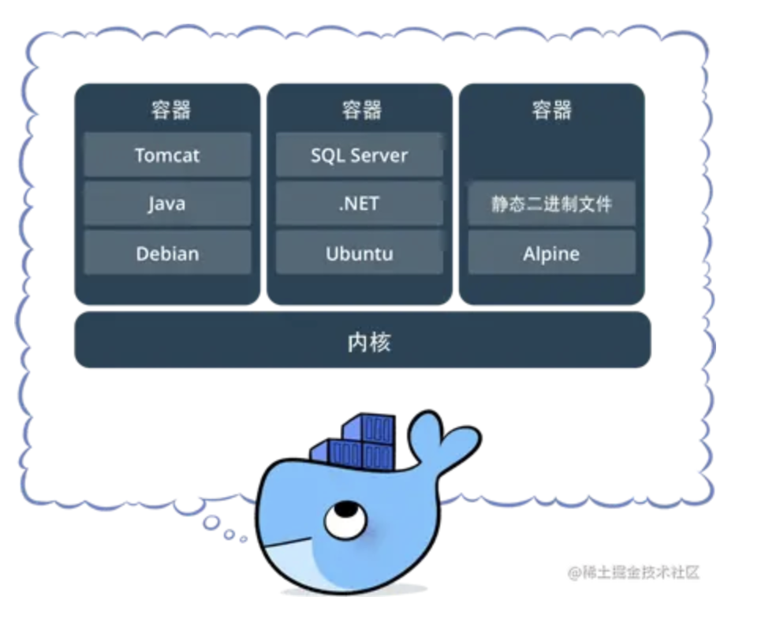

`Docker` 的优势在于 快速，轻量，灵活。开发者可以制作一个自己自定义的镜像，也可以使用官方或者其他开发者的镜像来启动一个服务。通过将镜像创建为容器，容器之间相互隔离资源和进程不冲突。但硬件资源又是共享的。 创建的镜像也可以通过文件快速分享，也可以上传到镜像库进行存取和管理。同时 `Docker` 的镜像有 `分层策略` ，每次对镜像的更新操作，都会堆叠一个新层。当你拉取 / 推送新版本镜像时，只推送 / 拉取修改的部分。大大加快了镜像的传输效率

那么 `Docker` 在 `CI/CD` 中的作用是什么呢？

`Docker` 贯穿 `CI/CD` 中整个流程。作为应用服务的载体有着非常重要的地位。

我们可以使用 `Docker` 将应用打包成一个镜像，交给 `Kubernetes` 去部署在目标服务集群。并且可以将镜像上传到自己的镜像仓库，做好版本分类处理

### 1、安装 Docker

在了解了 `Docker` 的作用后，我们来开始安装 `Docker`。在开始安装之前，需要安装 `device-mapper-persistent-data` 和 `lvm2` 两个依赖。

`device-mapper-persistent-data` 是 Linux 下的一个存储驱动， Linux 上的高级存储技术。 `Lvm` 的作用则是创建逻辑磁盘分区。这里我们使用 `CentOS` 的 `Yum` 包管理器安装两个依赖：

```bash
yum install -y yum-utils device-mapper-persistent-data lvm2
```

依赖安装完毕后，我们将阿里云的 `Docker` 镜像源添加进去。可以加速 `Docker` 的安装。

```bash
sudo yum-config-manager --add-repo http://mirrors.aliyun.com/docker-ce/linux/centos/docker-ce.repo
yum install docker-ce -y
```

安装成功显示如下：

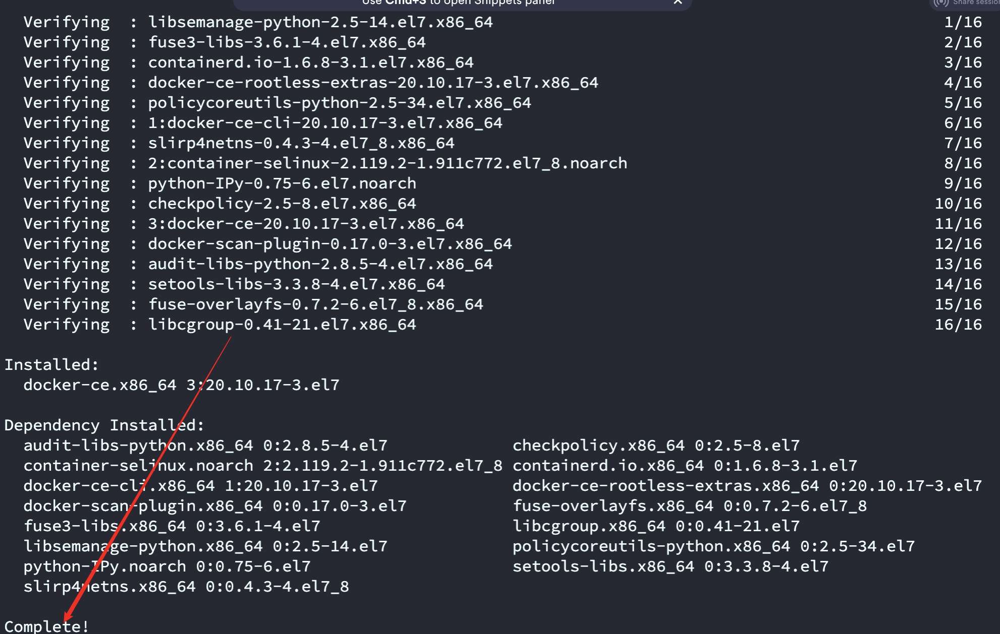

安装完毕，我们就可以使用 `systemctl` 启动来启动 `Docker` 了。`systemctl` 是 `Linux` 的进程管理服务命令，他可以帮助我们启动 `Docker `

```bash
systemctl start docker
systemctl enable docker
```

启动成功后显示如下：

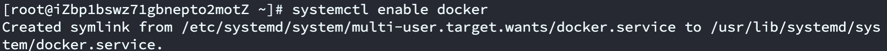

接着执行一下 `docker -v` ，这条命令可以用来查看 `Docker` 安装的版本信息。当然也可以帮助我们查看 `docker` 安装状态。如果正常展示版本信息，代表 `Docker` 已经安装成功。

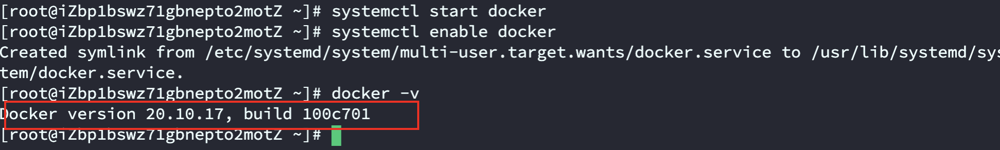

### 2、配置阿里云镜像源

在 `Docker` 安装完毕后，之后我们去拉取 `docker` 镜像时，一般默认会去 `docker` 官方源拉取镜像。但是国内出海网速实在是太慢，所以选择我们更换为 阿里云镜像仓库 源进行镜像下载加速。

登录阿里云官网，打开 [阿里云容器镜像服务](https://cr.console.aliyun.com/cn-hangzhou/instances/mirrors "阿里云容器镜像服务")。点击左侧菜单最下面的 镜像加速器 ，选择 `CentOS` （如下图）。按照官网的提示执行命令，即可更换 `docker`镜像源地址。

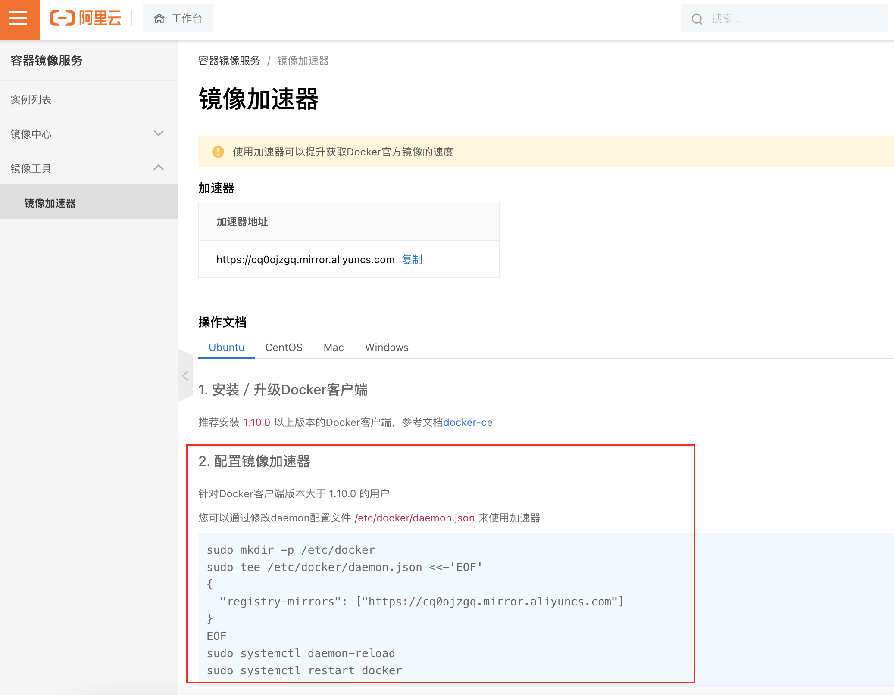

这里我已经复制出来了，安装步骤执行就可以了

```bash
sudo mkdir -p /etc/docker
sudo tee /etc/docker/daemon.json <<-'EOF'
{
  "registry-mirrors": ["https://cq0ojzgq.mirror.aliyuncs.com"]
}
EOF
sudo systemctl daemon-reload
sudo systemctl restart docker
```

## 二、安装 Jenkins

在安装完 `Docker` 后，我们只是拥有了一个可以承载服务的载体。想实现自动化构建，还需要安装另一个构建工具 `Jenkins`。那什么是 `Jenkins` 呢？

`Jenkins` 是一个基于 `Java` 语言开发的持续构建工具平台，主要用于持续、自动的构建/测试你的软件和项目。它可以执行你预先设定好的设置和构建脚本，也可以和 `Git` 代码库做集成，实现自动触发和定时触发构建。

### 1. 安装 OpenJDK

因为 `Jenkins` 是 `Java` 编写的持续构建平台，所以安装 `Java` 必不可少。

在这里，我们选择安装开源的 `openjdk` 即可。 `openjdk` 是 `SunJDK` 一种开源实现。关于`openjdk` 是 `SunJDK` 的具体区别可以看下面的文章了解下。在这我们直接使用 `yum` 包管理器安装 `openjdk` 即可。

```bash
yum install -y java
```

> [https://www.zhihu.com/question/19646618](https://www.zhihu.com/question/19646618 "https://www.zhihu.com/question/19646618")

### 2. 使用 Yum 安装 Jenkins

由于 `Yum` 源不自带 `Jenkins` 的安装源，于是我们需要自己导入一份 `Jenkins` 安装源进行安装。导入后，使用 `Yum` 命令安装即可。

#### 2.1获取jenkins源

```bash
# 获取jenkins源
sudo wget -O /etc/yum.repos.d/jenkins.repo https://pkg.jenkins.io/redhat-stable/jenkins.repo

```

不出意外的话，会提示如下错误：

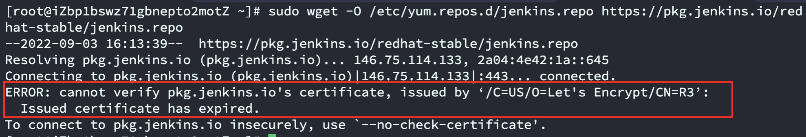

> 原因：使用wget命令时下载了不安全的https 域名下的内容。

解决方法：安装以下命令后，再下载。

```bash
sudo yum install -y ca-certificates
```

提示下载成功：

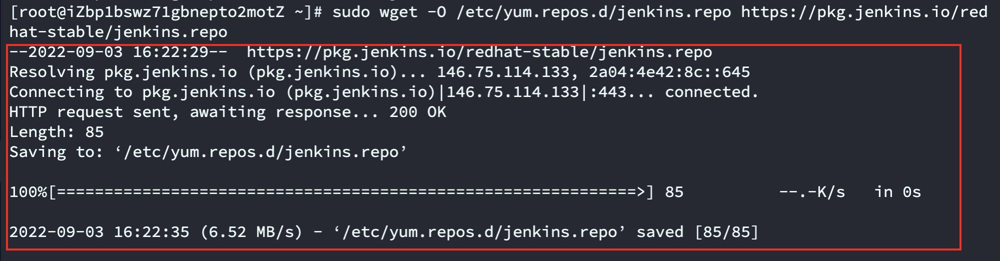

#### 2.2将jenkins源导入yum

```bash
# 将jenkins源导入yum
sudo rpm --import https://pkg.jenkins.io/redhat-stable/jenkins.io.key
```

#### 2.3使用yum安装jenkins

```bash
# 使用yum安装jenkins
yum -y install jenkins
```

### 3. 启动 Jenkins

`Jenkins` 安装后，会将启动命令注册到系统 `Service` 命令中。所以我们直接使用系统 `service` 命令启动 `Jenkins` 即可。在这里，有三个命令可以使用，分别对应 启动 / 重启 / 停止 三个命令。
在这里，我们直接调用 `service jenkins start` 启动 `Jenkins` 即可

```bash
service jenkins start
# service jenkins restart restart 重启 Jenkins
# service jenkins restart stop 停止 Jenkins
```

启动需要一段时间，需要等等，启动成功后如下：

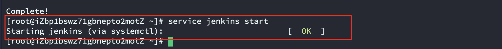

### 4. 给 Jenkins 放行端口

> 阿里云`centos7.8`系统无需在服务器上开放此端口，可以直接跳转`4.2步骤` 在安全组中进行配置。

#### 4.1、放行服务器端口

在启动 `Jenkins` 后，此时 `Jenkins` 会开启它的默认端口 `8080` 。但由于防火墙限制，我们需要手动让防火墙放行 8080 端口才能对外访问到界面。

这里我们在 `CentOS` 下的 `firewall-cmd` 防火墙添加端口放行规则，添加完后重启防火墙。

```bash
# 开放服务器端口
firewall-cmd --zone=public --add-port=8080/tcp --permanent
firewall-cmd --zone=public --add-port=50000/tcp --permanent
# 重启防火墙
systemctl reload firewalld
```

#### 4.2、开放阿里云安全组端口

*   进入实例的安全组界面，点击`配置规则`

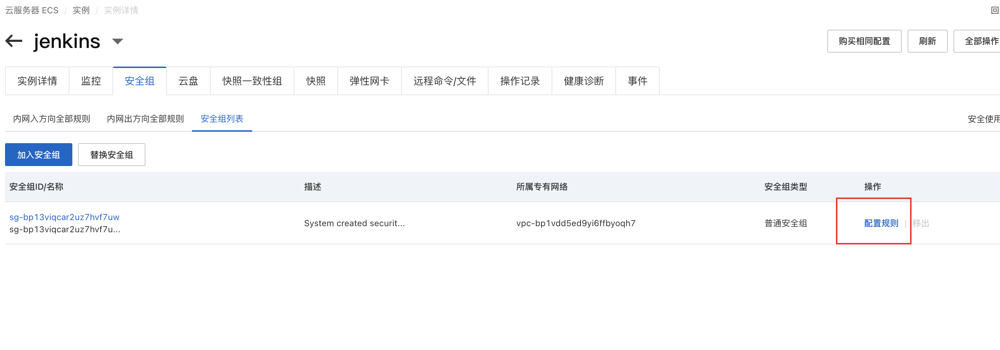

*   点击手动添加 → 填写端口 → 选择授权对象 → 保存

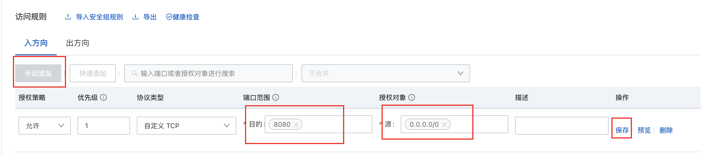

服务启动后，访问 `IP:8080` , `Jenkins` 第一次的启动时间一般比较长（视服务器性能而看）

### 5. 初始化 Jenkins 配置

#### 5.1 解锁 Jenkins

在 `Jenkins` 启动完成后，会自动跳转到解锁界面，你需要输入存放在服务器的初始解锁密码才能进行下一步操作。

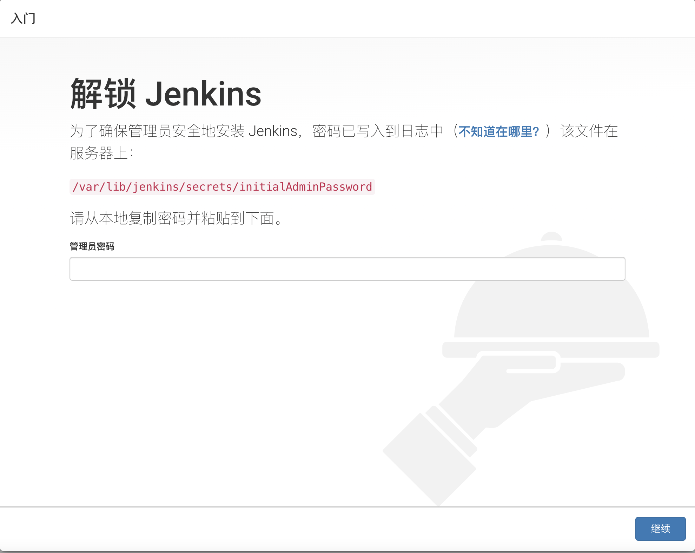

`Jenkins` 启动后，会生成一个初始密码。该密码在服务器的文件内存放，我们可以进入服务器查看密码内容，将密码填写在 `Jenkins` 的管理员密码输入框内：

```bash
cat /var/lib/jenkins/secrets/initialAdminPassword
```

#### 5.2 下载插件

解锁后就来到了插件下载页面，这一步要下载一些 `Jenkins` 的功能插件。

因为 `Jenkins` 插件服务器在国外，所以速度不太理想。我们需要更换为清华大学的 `Jenkins` 插件源后，再安装插件，所以先不要点安装插件。

更换方法很简单。进入服务器，将 `/var/lib/jenkins/updates/default.json` 内的插件源地址替换成清华大学的源地址，将 `google` 替换为 `baidu` 即可。

```bash
sed -i 's/http:\/\/updates.jenkins-ci.org\/download/https:\/\/mirrors.tuna.tsinghua.edu.cn\/jenkins/g' /var/lib/jenkins/updates/default.json && sed -i 's/http:\/\/www.google.com/https:\/\/www.baidu.com/g' /var/lib/jenkins/updates/default.json
```

接着点击 `安装推荐的插件` 即可。稍等一会插件安装完毕

插件安装中如图所示：

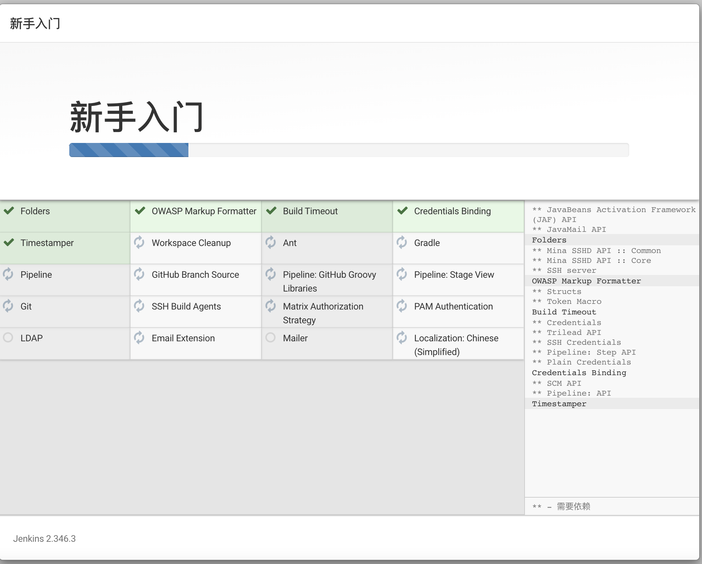

### 6. 完成安装

插件安装完毕后，接着是注册管理员账号，请记住填写的`用户名`和`密码`，填写完信息后点击`保存并完成`，就可以看到下面界面：

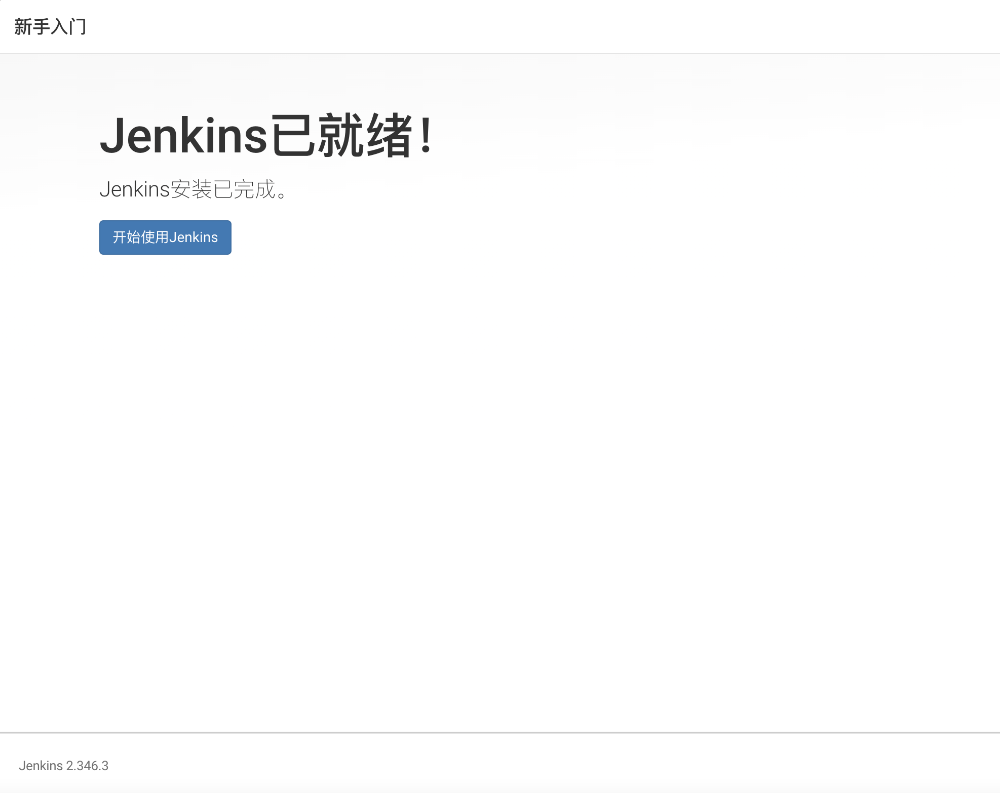

### 7. 测试安装

到这里，我们的 `Jenkins` 算是搞完了。但是，我们还需要对 `Jenkins` 做一点点简单的配置，才可以让它可以构建 `docker` 镜像。

我们点击 `Jenkins` 首页 -> 左侧导航 -> 新建任务 -> Freestyle project

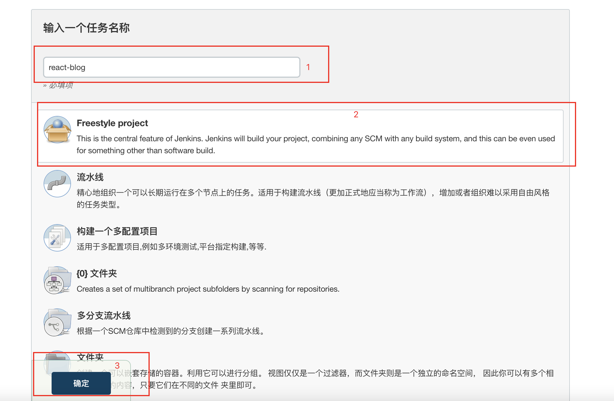

> 创建的这个任务后续将和`Docker` 、 `Git仓库`、`k8s`、`阿里云镜像仓库`等进行集成。

新建完毕后，找到 `构建` 一项，选择 `增加构建步骤`，选择 执行`shell`&#x20;

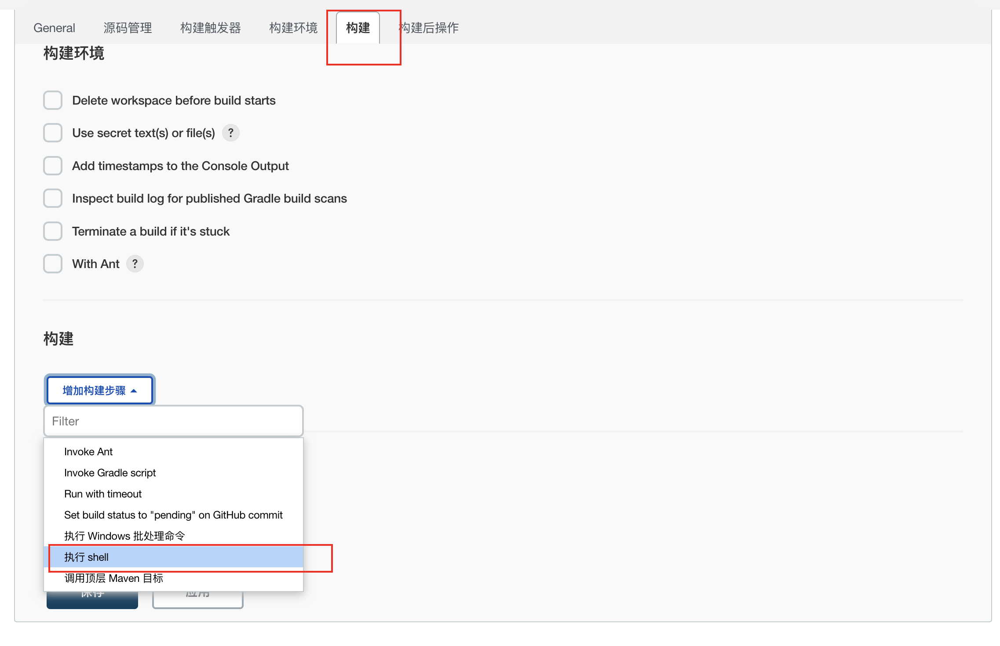

输入以下命令后点击`保存`。

```bash
docker -v
docker pull node:latest
```

该命令会去拉取一个 `nodejs` 稳定版的镜像，我们可以来测试 `Docker` 的可用性

保存后，我们点击左侧菜单的立即构建， `Jenkins` 就会开始构建。

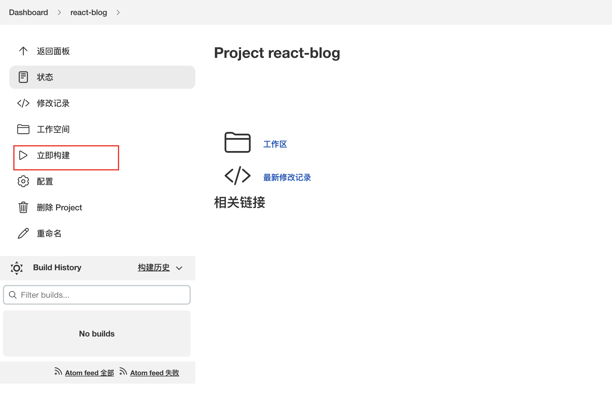

选择左侧历史记录第一项（最新的一项），点击控制台输出，查看构建日志。

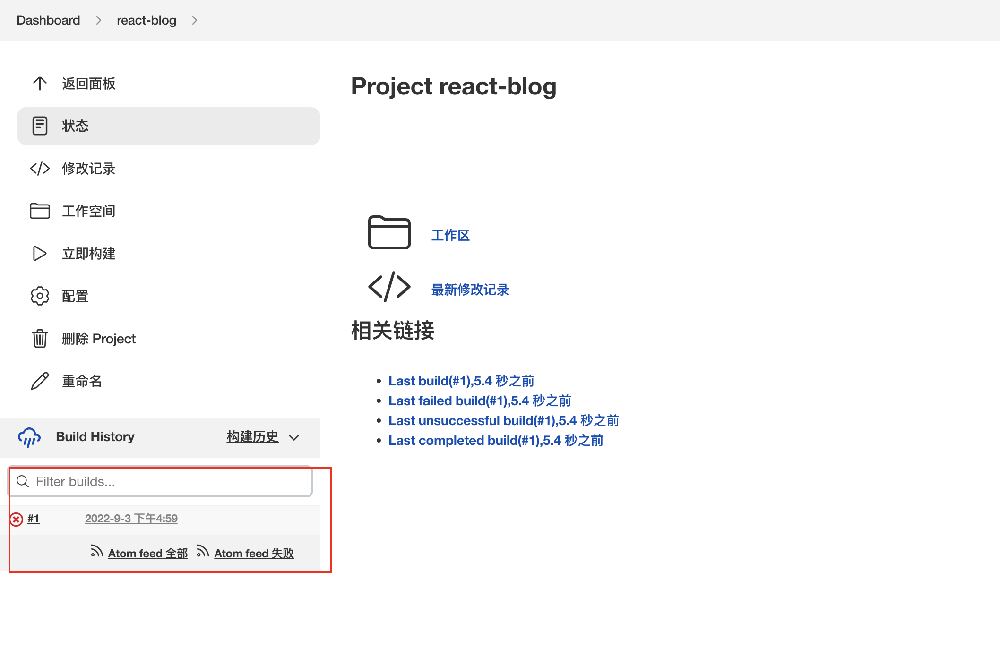

执行后，我们发现提示`无访问权限`。这又是什么情况呢？这里就不得不提到 `Linux` 下的 `Unix Socket`权限问题了

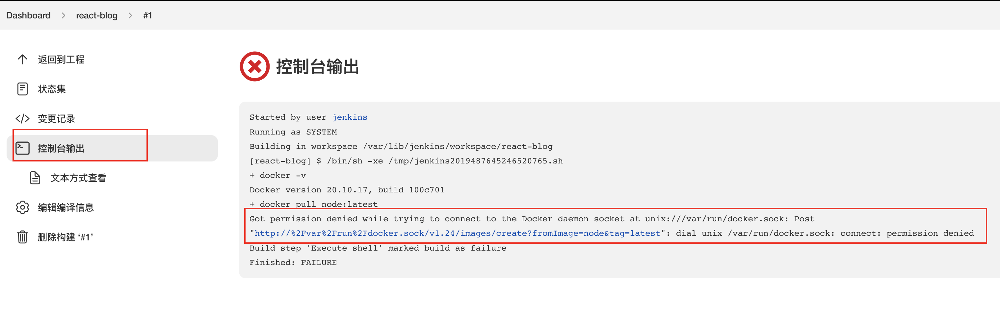

### 8. Unix Socket 权限问题

`docker` 的架构是 `C/S`架构。在我们使用 `docker` 命令时，其实是命令使用 `socket` 与 `docker` 的守护进程进行通信，才能正常执行 `docker` 命令。

而在 `Linux` 中， `Unix socket` 属于 `root` 用户，因此需要 `root` 权限才能访问。官方是这么解释的：

> Manage Docker as a non-root user The docker daemon binds to a Unix socket instead of a TCP port. By default that Unix socket is owned by the user root and other users can only access it using sudo. The docker daemon always runs as the root user. If you don’t want to use sudo when you use the docker command, create a Unix group called docker and add users to it. When the docker daemon starts, it makes the ownership of the Unix socket read/writable by the docker group.
> 将Docker管理为非root用户Docker守护进程绑定到Unix套接字而不是TCP端口。默认情况下，Unix套接字由root用户拥有，其他用户只能使用sudo访问它。docker守护进程始终作为根用户运行。如果在使用docker命令时不想使用sudo，请创建一个名为docker的Unix组，并将用户添加到其中。当docker守护进程启动时，它使Unix套接字的所有权可由docker组读/写。

但是在 `docker` 中， `docker` 提供了一个 用户组 的概念。我们可以将执行 `Shell` 的用户添加到名称为 `docker` 的用户组，则可以正常执行 `docker` 命令。

而在 `Jenkins` 中执行的终端用户叫做 `jenkins` ，所以我们只需要将 `jenkins` 加入到 docker 用户组即可：

#### 8.1、配置用户组

```bash
# 新增docker用户组
sudo groupadd docker   
# 将当前用户添加至docker用户组       
sudo gpasswd -a jenkins docker  
# 更新docker用户组
newgrp docker                
```

加入后，重启 `Jenkins` ：

```bash
sudo service jenkins restart
```

重启 `Jenkins` 后，再次执行`立即构建`。此时提示`SUCCESS`执行成功：

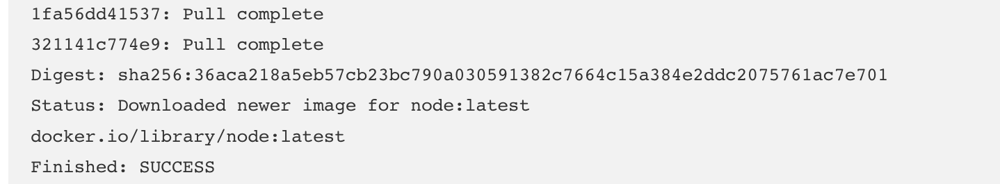

### 结束语

到这里为止，我们的基础组件 —— `docker` 和 `Jenkins` 就安装完毕了。不过，这只是持续构建的第一步。在下一章，我们会在服务器上安装 `Node` 环境，并集成 `Git` 代码库实现对代码的镜像构建。
