# 02-使用jenkins构建镜像： 将你的应用打包成镜像

## 前言

***

在上一节中，我们安装了 `Docker` 和 `Jenkins`，并实现了将两者打通。在这一章中，我们则使用 `Jenkins` 集成 `Git` 来构建 `Docker` 镜像，为后面的部署准备镜像资源。

## 1. 安装 Nodejs 环境

***

在上一章，我们其实并没有在服务端安装 `Node` 环境。如果想要安装 `Node` 环境，有以下两个办法：

*   源码编译：这种方式是将 `Node`     源码拉下来后，在服务器端编译完成后才可以使用。时间比较长，流程也略复杂

*   使用 `Jenkins Plugin` 中 `NodeJS` 插件自动配置安装

在这里，我们可以选择第二种方式来安装，既方便又省力。

我们打开 `Jenkins` 首页，找到左侧的\*\*系统配置 → 插件管理 \*\*

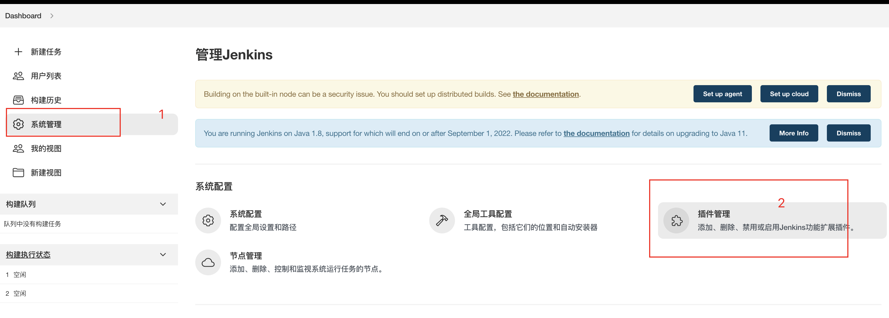

点击`可选插件`搜索 `Node` 。选中 `NodeJS` 后，点击左下角的 `直接安装` 开始安装插件

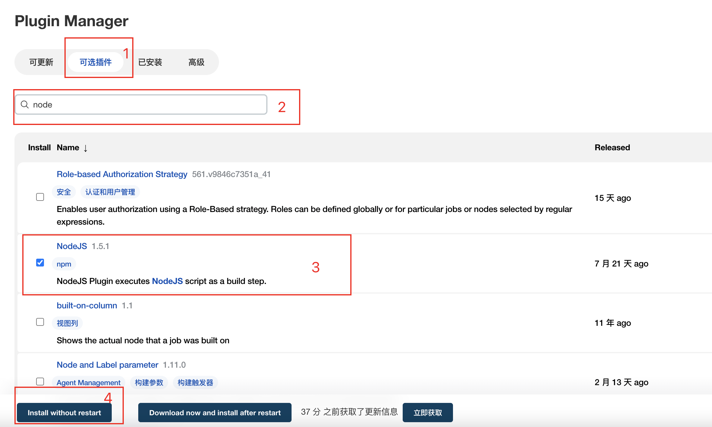

安装成功提示：

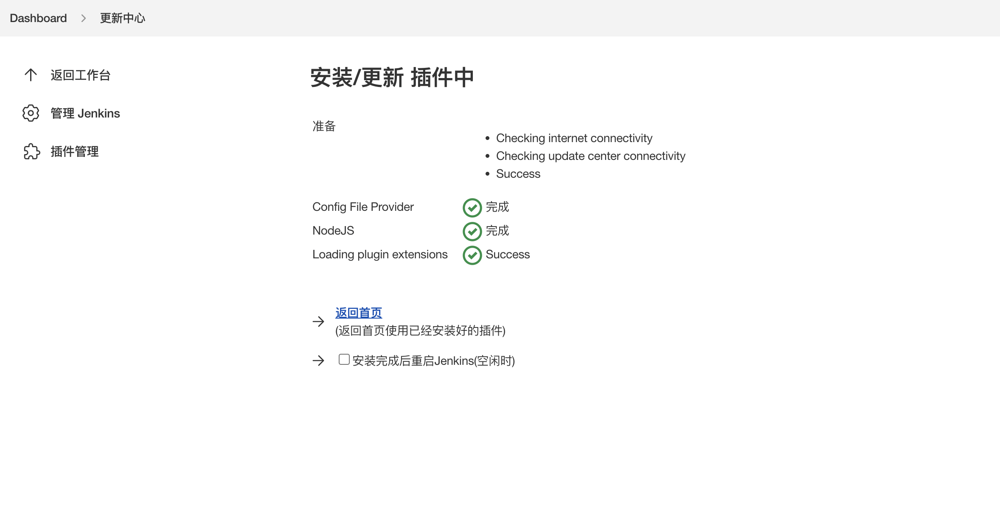

等待安装完毕后，返回 `Jenkins` 首页。找到 **Global Tool Configuration => NodeJS => 新增NodeJS**

接着回到 `Jenkins` 首页，找到左侧的 `系统配置` ，选择 `全局工具配置`

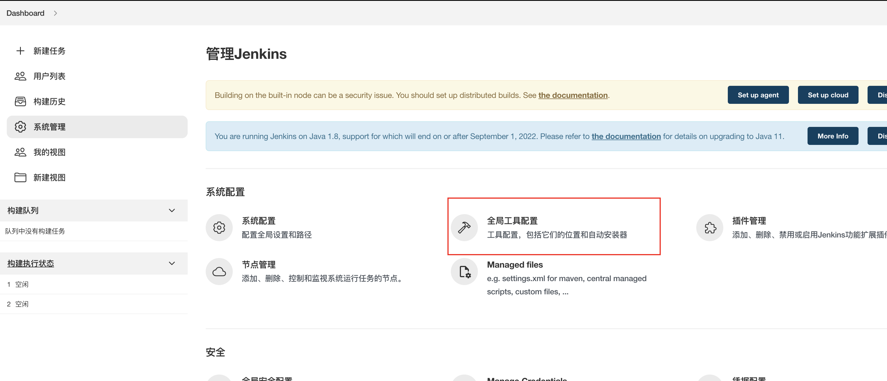

填写`别名`，然后`选择版本号`,最后保存即可。

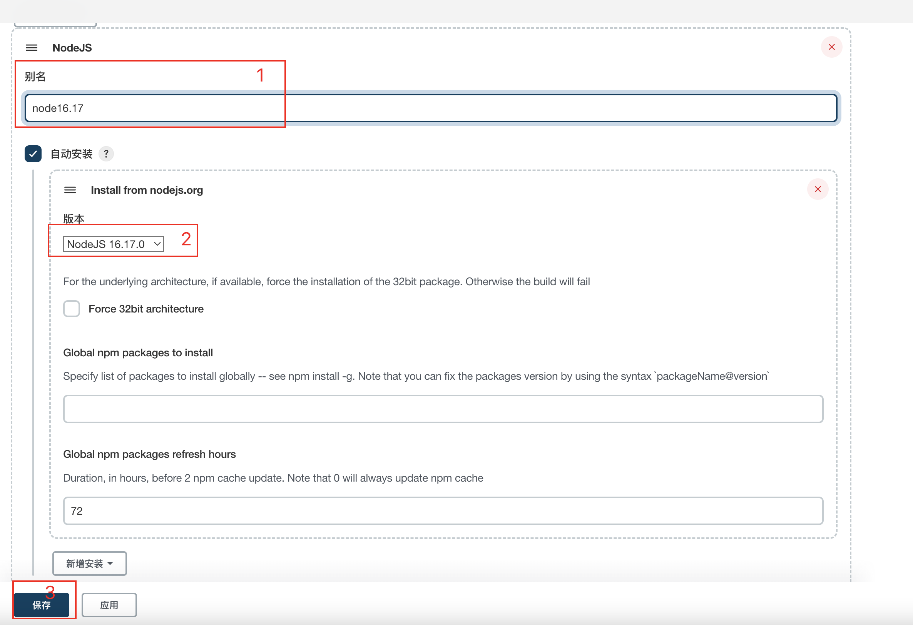

## 2、如何使用？

那我们在任务中如何使用呢？我们只需要在`任务`的****中，找到****，选中 `Provide Node & npm bin/ folder to PATH` ，选择刚才配置好的 `NodeJS` 即可。

#### 2.1点击任务名称&#x20;

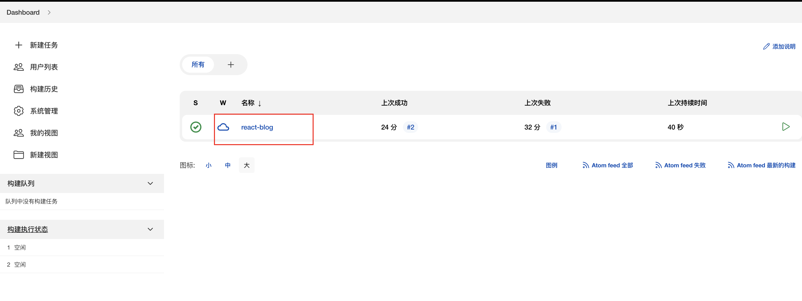

#### 2.2点击构建

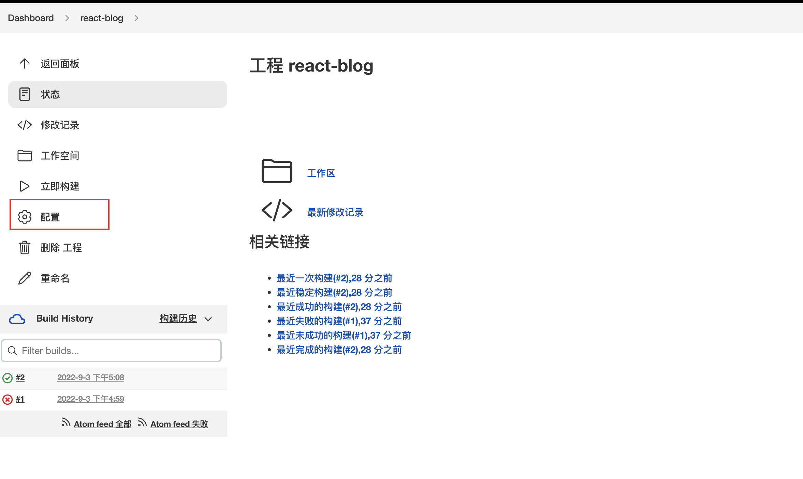

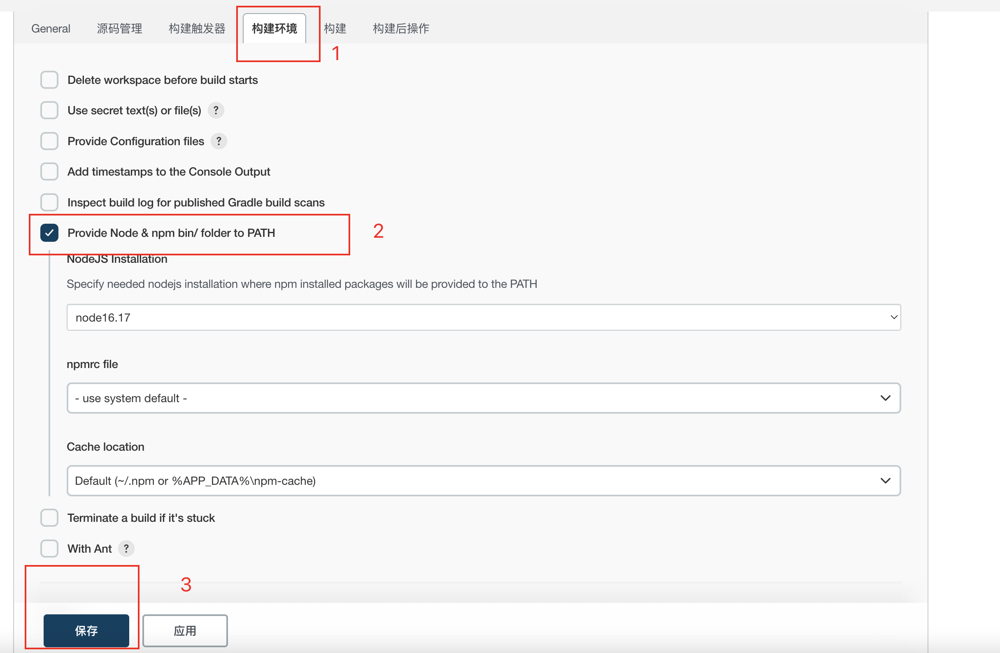

第一次执行会下载对应的 `Node` 版本，后续不会下载。

## 3. 使用 SSH 协议集成 Git 仓库源

这一步，我们使用 `Jenkins` 集成外部 Git 仓库，实现对真实代码的拉取和构建。在这里，我们选用 `Gitee` 作为我们的代码源。(为避免部分人员无法访问Github，因此采用Gitee)

### 1、 创建仓库并提交到Gitee (这一部分请大家自行完成)

### 2、 生成公钥私钥

首先，我们先来配置公钥和私钥。这是 `Jenkins` 访问 `Git` 私有库的常用认证方式。我们可以使用 `ssh-keygen` 命令即可生成公钥私钥。

首先安装在服务器安装`git`

```bash
yum -y install git
```

#### 2.1 然后进入jenkins用户下

```bash
sudo su -s /bin/bash jenkins
```

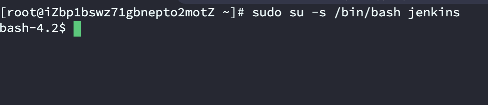

#### 2.2 生成秘钥

```bash
ssh-keygen -t rsa -C "替换成你的邮箱地址"
```

执行后一路回车即可, 默认是放在 `~/.ssh/id_rsa` 下，随后进入`~/.ssh`查看文件

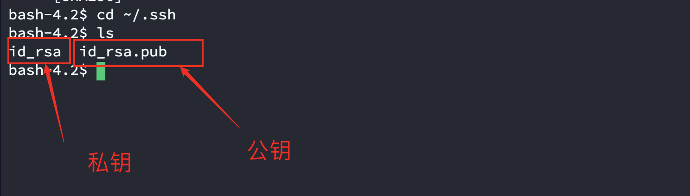

**我们需要在  端配置公钥，在  端使用私钥与  进行身份校验。**

#### 2.3 在 Gitee 配置公钥

在 `Gitee` 中，如果你要配置公钥有2种方式：仓库公钥 和 个人公钥。**其中，如果配置了仓库公钥，则该公钥只能对配置的仓库进行访问。如果配置了个人公钥，则账号下所有私有仓库都可以访问。**

*   查看公钥

```bash
cat id_rsa.pub
```

执行完毕后，`复制`打印出来的结果到下图中的`公钥`里

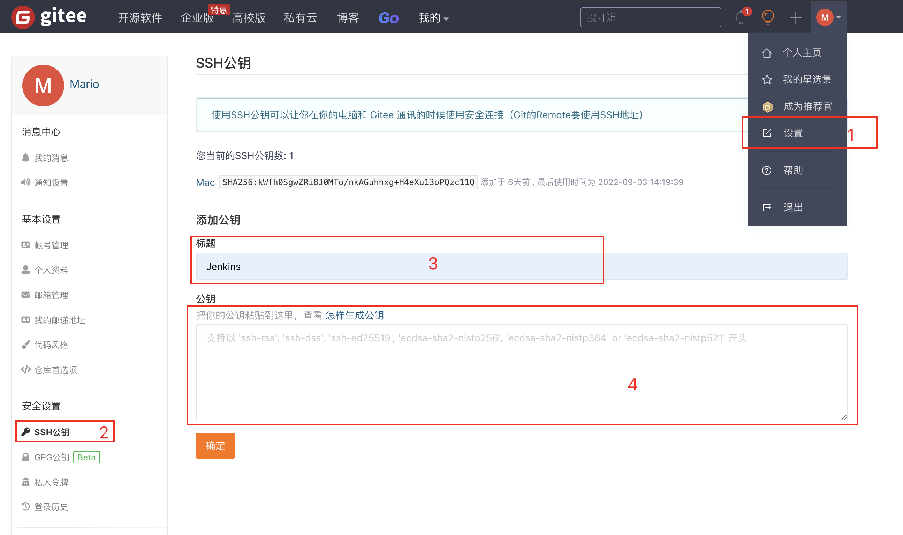

#### 2.3 在 Jenkins 配置私钥

回到 `Jenkins`。在 `Jenkins `中，私钥/密码 等认证信息都是以 `凭证` 的方式管理的，所以可以做到全局都通用。 我们可以在配置任务时，来添加一个自己的凭证。点击项目的 `配置`，依次找到 `源码管理` →Git → Repositories

*   点击配置

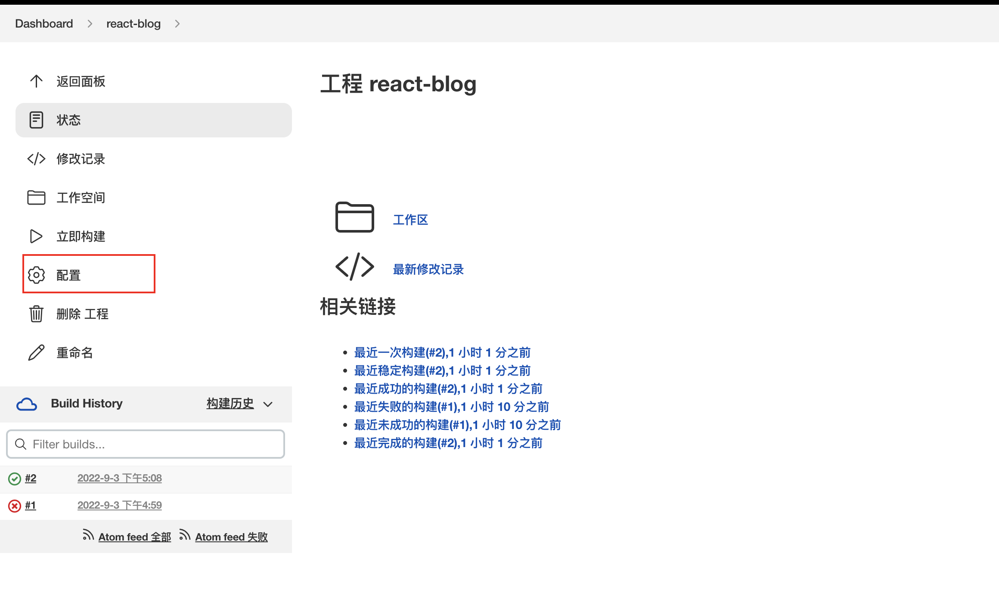

*   输入`Gitee`上的仓库地址

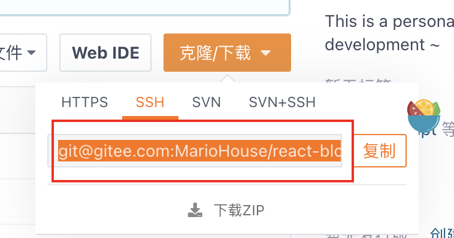

*   点击添加凭证

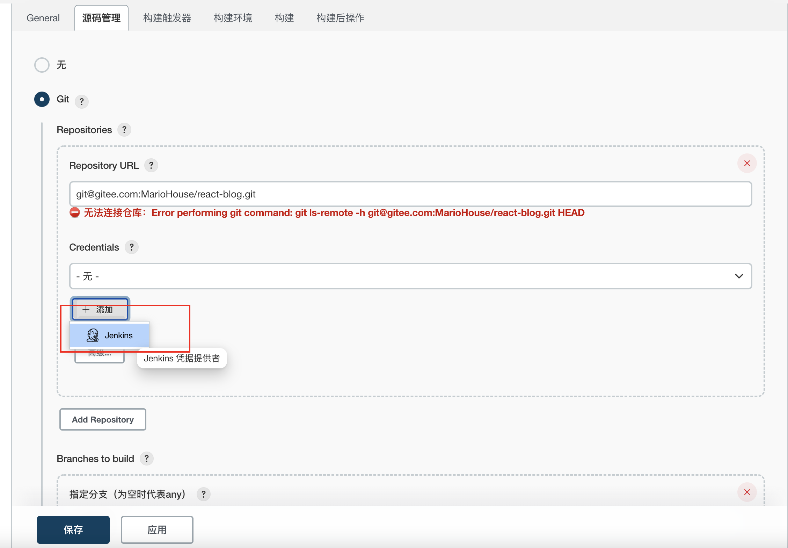

点击后会打开一个弹窗，这是 `Jenkins` 添加凭证的弹窗。选择类型中的 `SSH Username with private key` 这一项。

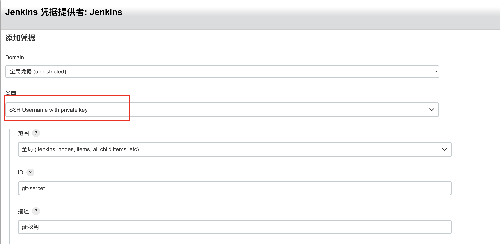

接着填写信息即可：

*   ID：这条认证凭证在 `Jenkins` 中的名称是什么

*   描述：描述信息

*   Username：用户名（邮箱）

*   Private Key：这里则是我们填写私钥的地方。

勾选`Enter directly`后，进入服务器查看私钥 ，复制输出的`私钥`

```bash
cat id_rsa
```

> **将 私钥文件内所有文件内容全部复制过去（****包含开头的 BEGIN OPENSSH PRIVATE KEY 和结尾的 END OPENSSH PRIVATE KEY****）**

如图所示：

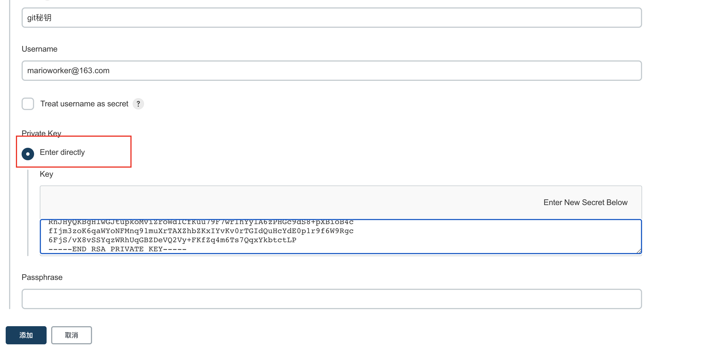

最后点击添加。

#### 2.4 无法连接？

*   报错如下:

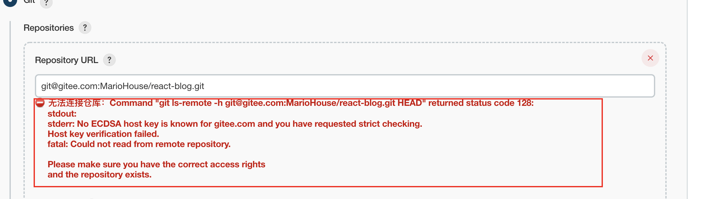

*   执行如下命令将`gitee`加入到`known_hosts`文件中。

```bash
ssh -T git@gitee.com
```

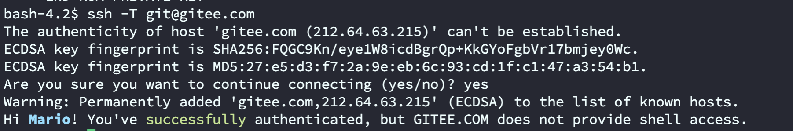

> 注意：执行此命令的前提是已经在`Gitee`上配置了`私钥`

再次查看，完美 ！最后`点击保存`

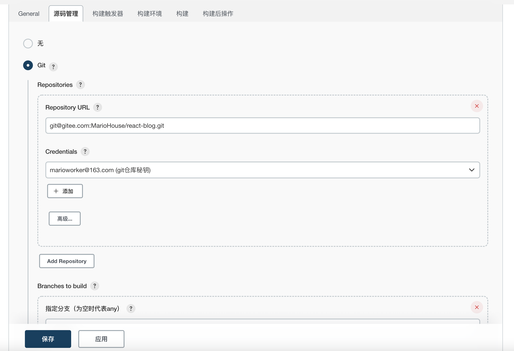

### 3. 构建镜像

在我们将环境准备就绪后，就可以开始构建镜像了。不过，我们需要先准备个 `DockerFile` 才可以构建镜像。那什么是 `DockerFile` 呢？

#### 3.1 编写 Dockerfile

#### 什么是 Dockerfile

`Dockerfile`  是一个 `Docker` 镜像的基础描述文件，里面描述了**生成一个镜像所需要的执行步骤**。我们也可以自定义一份 `Dockerfile` 来创建一个自己的镜像。

例如下面的步骤，使用 `Dockerfile` 可描述为：

1.  基于 `nginx:1.15` 镜像做底座。

2.  拷贝本地 `build` 文件夹内的文件，到镜像内 `/etc/nginx/html` 文件夹。

3.  拷贝本地 `nginx.conf` 文件，到镜像内 `/etc/nginx/`  文件夹。

```bash
FROM nginx:1.15-alpine
COPY build /etc/nginx/html
COPY nginx.conf /etc/nginx
WORKDIR /etc/nginx/html
```

编写完成后，怎么生成镜像呢？我们只需要使用 `docker build` 命令就可以构建一个镜像了：

```bash
docker build -t imagename:version .
```

> \-t: 声明要打一个镜像的Tag标签，紧跟着的后面就是标签。
> &#x20;标签格式为:    \[镜像名]:\[版本] \[寻找dockerfile文件的路径]&#x20;
> . 代表当前路径下寻找。默认文件名为 Dockerfile。&#x20;
> 关于更多 DockerFile 的语法，详细可以看这里[https://www.runoob.com/docker/docker-dockerfile.html](https://www.runoob.com/docker/docker-dockerfile.html "https://www.runoob.com/docker/docker-dockerfile.html")

因为我们的镜像只包含一个 `nginx`，所以 `dockerfile` 内容比较简单。我们只需要在代码根目录下新建一个名为 `Dockerfile` 的文件，输入以下内容，并将其提交到代码库即可。

*   创建`Dockerfile`文件

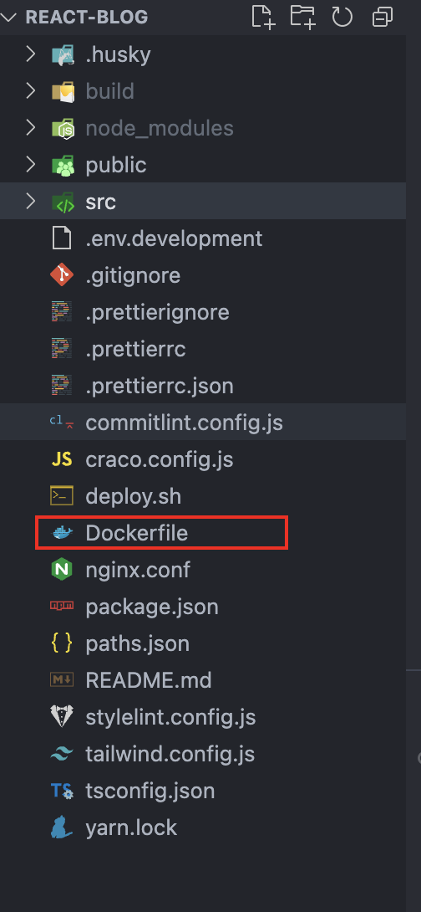

*   在`Dockerfile`文件中输入以下内容:

```bash
FROM nginx:1.15-alpine
COPY build /etc/nginx/html
COPY nginx.conf /etc/nginx
WORKDIR /etc/nginx/html
```

*   提交到`git`仓库

```bash
git add .
git commit -m "chore: add dockerfile"
git push
```

#### 3.2 Jenkins 端配置

在代码源和 `DockerFile` 准备就绪后，我们只需在 `Jenkins` 端配置下要执行的 `Shell` 脚本即可。

找到项目的`配置`，依次找到\*\* 构建 → 执行shell\*\*。

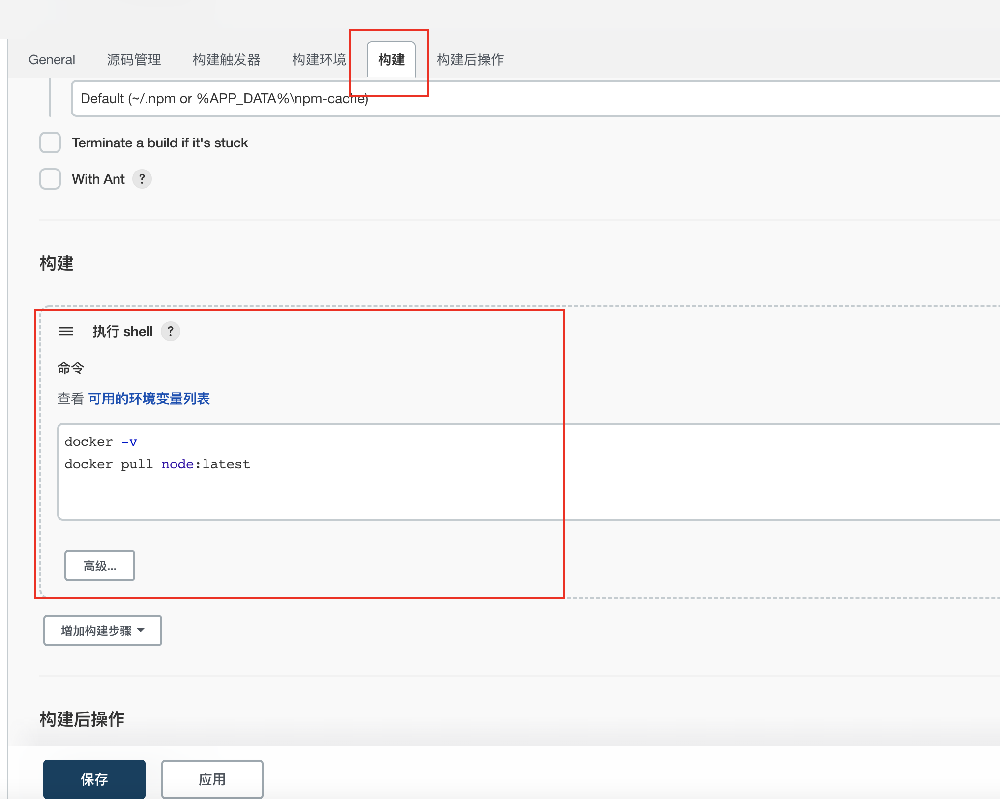

更新`shell`的内容：

```bash
# 查看docker版本
docker -v
# 拉取node镜像
docker pull node:latest
# 获取当前服务器时间，并输出到环境变量
time=$(date "+%Y%m%d%H%M%S")
# 设置npm镜像源
npm config set registry https://registry.npm.taobao.org
# 全局安装yarn
npm install -g yarn
# 设置yarn镜像源
yarn config set registry https://registry.npm.taobao.org
# 安装项目的node_modules模块
yarn
# 打包项目
yarn build
# 获取镜像名称为react-blog的历史镜像id，并输出到环境变量
# 历史镜像可能包括: 构建失败的镜像和临时镜像
imageid=`docker images|grep react-blog|awk '{print $3}'`
# 删除构建失败的镜像
[ ! -z "$imageid" ] && docker image rmi -f $imageid
# 打包镜像
docker build -t react-blog:$time .
# 查看镜像
docker images

```

更新完成后点击`保存`

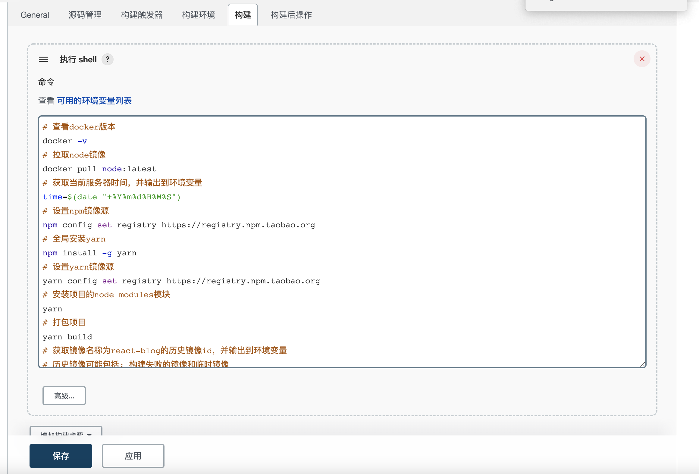

### 4. 执行任务

点击`立即构建` → `查看构建过程`

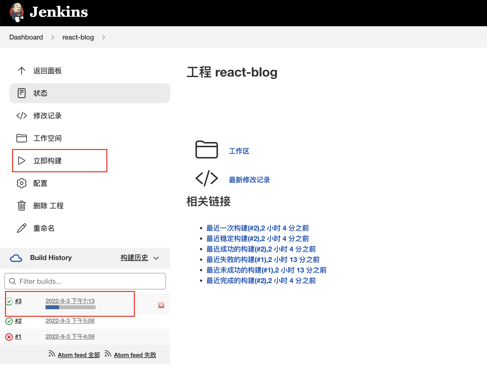

保存后我们去手动触发执行下任务。当未抛出错误时，代表任务执行成功。

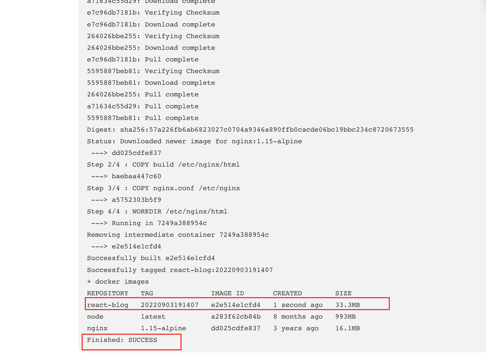
