# 03-将镜像上传至镜像库

镜像上传到镜像库有两种方法：

*   自己搭建镜像库  (没有仓库个数限制，但是比较耗费服务器内存资源)

*   使用阿里云的镜像库 (免费、服务比较稳定，但是个人版有仓库个数限制)

起初使用的是`nexus`搭建镜像库服务，奈何`nexus`服务比较耗费服务器内存，经常因为`内存溢出`被杀掉，就尝试使用`harbor`搭建个人镜像库，当然也可以使用[阿里云提供的镜像库服务](https://cr.console.aliyun.com/cn-hangzhou/instances "阿里云提供的镜像库服务")。

## 什么是harbor

> Harbor是一个用于存储和分发Docker镜像的企业级Registry服务器

## 一、搭建harbor镜像库

### 1、 安装docker-compose

```bash
curl -L "https://get.daocloud.io/docker/compose/releases/download/1.27.3/docker-compose-$(uname -s)-$(uname -m)" -o /usr/local/bin/docker-compose
```

*   安装成功后

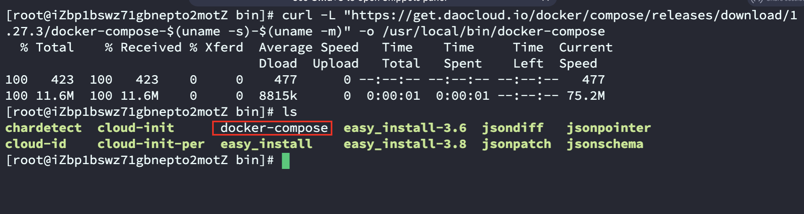

*   添加权限

```bash
sudo chmod +x /usr/local/bin/docker-compose
```

### 2、搭建Harbor

#### 2.1 下载harbor

```bash
wget https://storage.googleapis.com/harbor-releases/release-1.8.0/harbor-offline-installer-v1.8.4.tgz
```

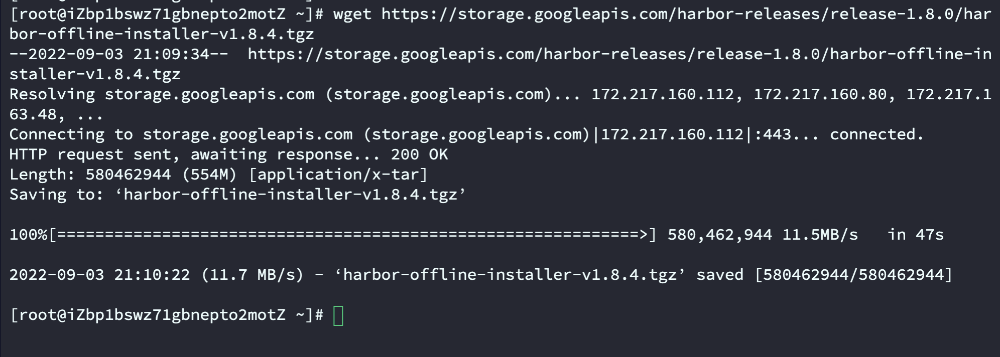

#### 2.2解压

```bash
tar zxvf harbor-offline-installer-v1.8.4.tgz
```

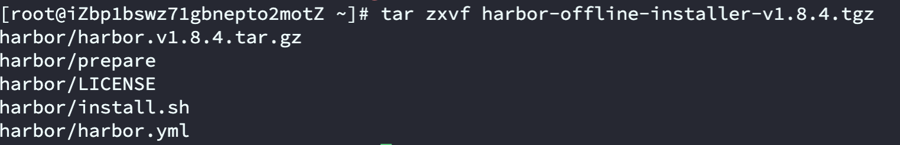

#### 2.3修改配置

*   执行`ls`查看当前目录下文件

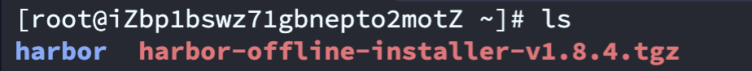

*   执行`cd`命令进入`harbor`目录

```bash
cd harbor
```

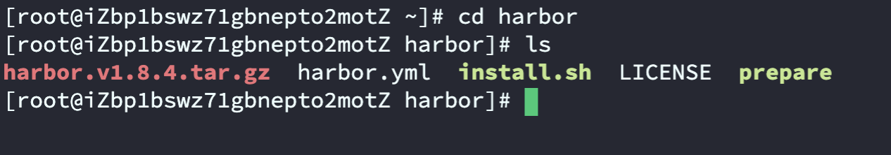

*   编辑配置

```bash
vim harbor.yml
```

*   修改`hostname`为主机`ip`，可以使用以下命令查看`ip`，还需要修改`port`字段的值，这是服务器的运行端口，在`公网`访问时，需要在阿里云安全组中配置。(可参考安装docker这节中的4.2步骤)

```bash
# 查看ip 
curl ifconfig.me

```

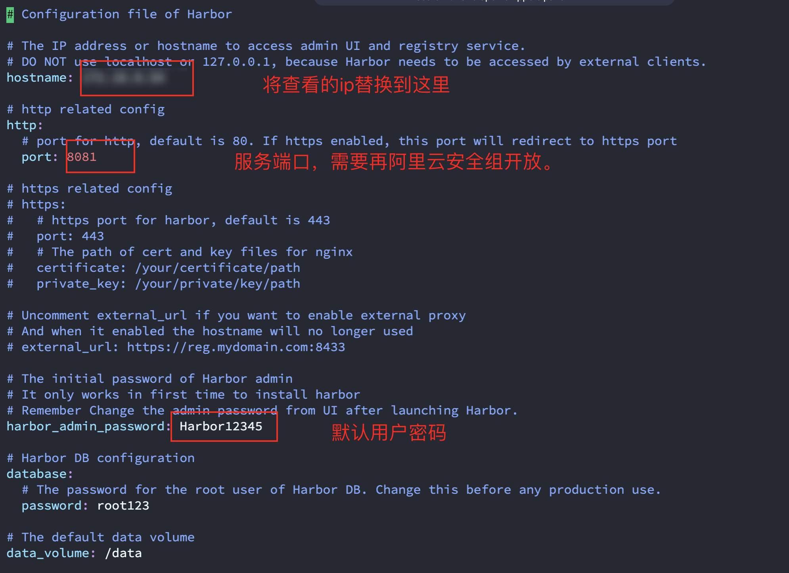

#### 2.4 启动Harbor

*   依次执行以下命令，然后耐心等待。

```bash
./prepare
./install.sh

```

安装成功如下所示:

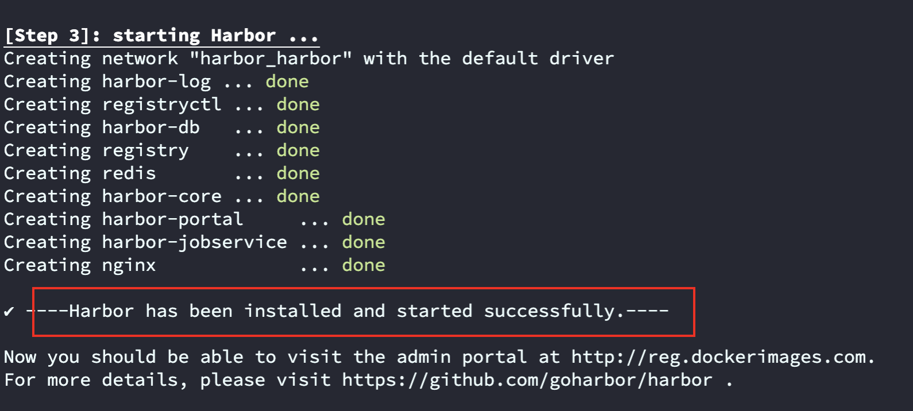

*   访问地址：`服务器ip:8081` ，访问成功。

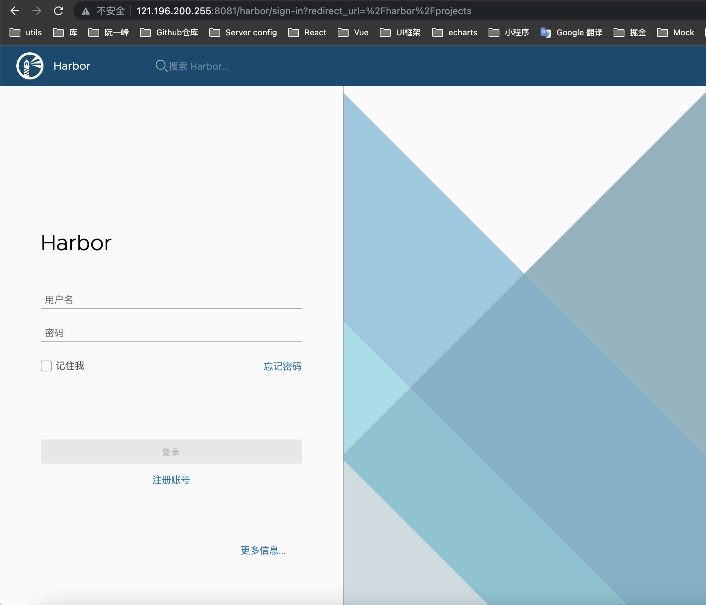

*   账号为默认账号:：`admin`密码：`Harbor12345`，密码可在`harbor.yml`文件中查看

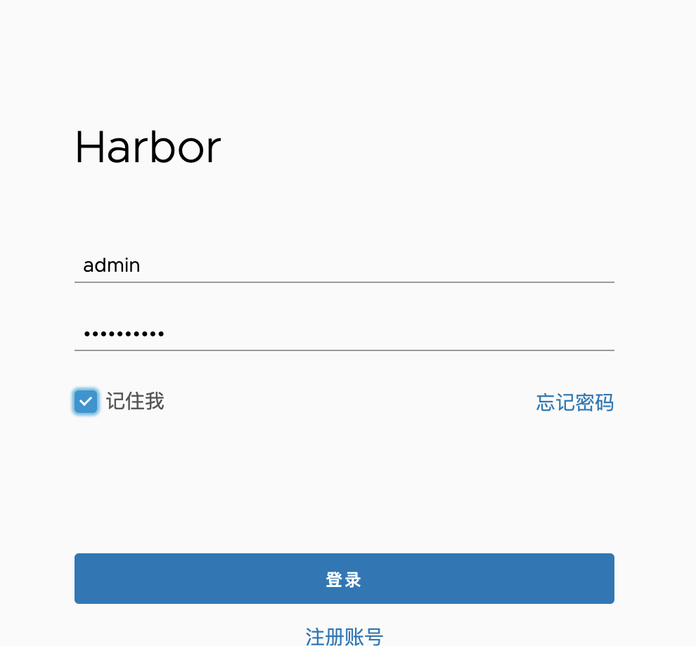

登录成功后，界面如下，`library`为默认的仓库。

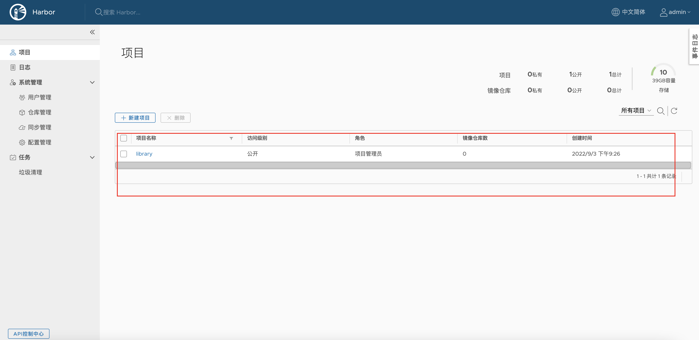

### 3、配置Docker

当安装好之后，我们需要赋予`docker`访问`harbor`的权限。否则连接不上就不能上传或者拉取镜像了。这里我们需要修改`docker`的配置文件。

```bash
# 编辑docker配置文件
vi  /etc/docker/daemon.json
```

#### 3.1添加以下配置

```bash
{
  "registry-mirrors": ["https://cq0ojzgq.mirror.aliyuncs.com"],
  # 新增insecure-registries
  "insecure-registries":["服务器ip:8081"]
}

```

#### 3.2重启docker

```bash
systemctl restart docker
```

3.3 验证`docker`是否能连接到`harbor`

```bash
# docker login -u 登录用户名 -p 登录密码 服务器ip:8081
docker login -u admin -p Harbor12345 这里换成你自己的服务器ip:8081

```

验证成功

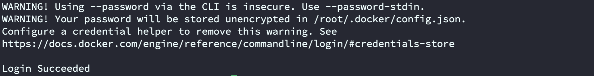

### 4、上传镜像

登录成功后，我们就可以测试啦。

#### 4.1新建项目，勾选公开。

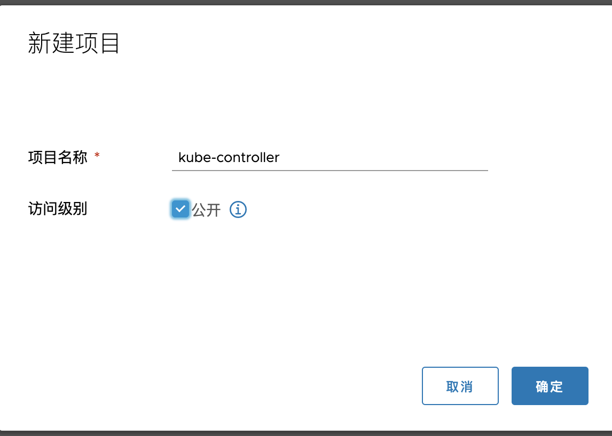

由于在后续部署`k8s`集群中，会有两个谷歌的镜像拉取不下来，我这里已经给大家准备好了，刚好大家可以将这两个镜像推送到自己的仓库中，方便后续拉取。

#### 4.2在服务器上拉取镜像

```bash
docker pull registry.cn-hangzhou.aliyuncs.com/ali-k8s-images/ingress-nginx:v1.0.4

```

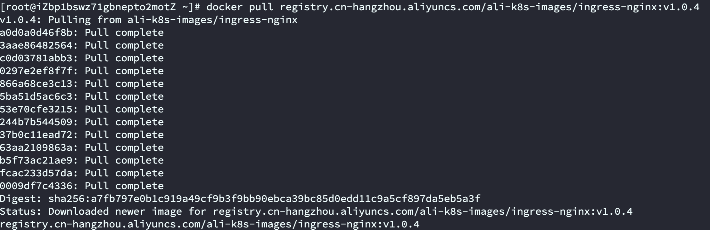

#### 4.4 查看当前拉取的镜像

```bash
docker images
```

图中所示就是刚刚拉取的镜像

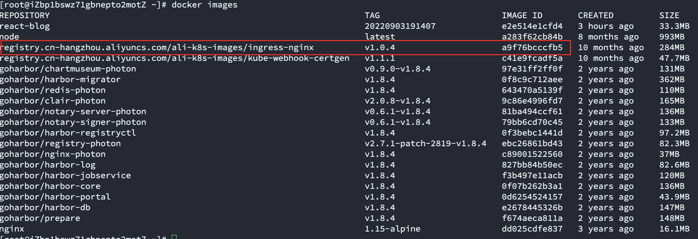

#### 4.4 给当前镜像打标签

```bash
# 镜像id: 替换成上图红框中镜像对应的IMAGE ID
# 服务器ip: 替换自己的镜像服务器ip
# 镜像名称: 镜像的名称，可以自己定义
# docker tag [镜像id] [服务器ip]/kube-controller/[镜像名称]:[版本]
docker tag 镜像id 服务器ip/kube-controller/kube-controller:v1.0.4
```

> 一个镜像仓库可以提交多个镜像，也就是说每次打标签的时候，只需要修改上面命令的`镜像id`和`镜像名称`，就可以喽。

#### 4.5将当前镜像提交到harbor镜像仓库

*   使用`docker images`再次查看`docker`镜像，可以看到多出来了一个镜像，我们就将这个镜像推送到自己的私人镜像库中。

```bash
# 服务器ip: 替换自己的镜像服务器ip
# 这里推送的镜像就是刚打完标签的镜像
# docker push [步骤4.4打完标签后的镜像名称]
docker push 服务器ip:8081/kube-controller/kube-controller:v1.0.4
```

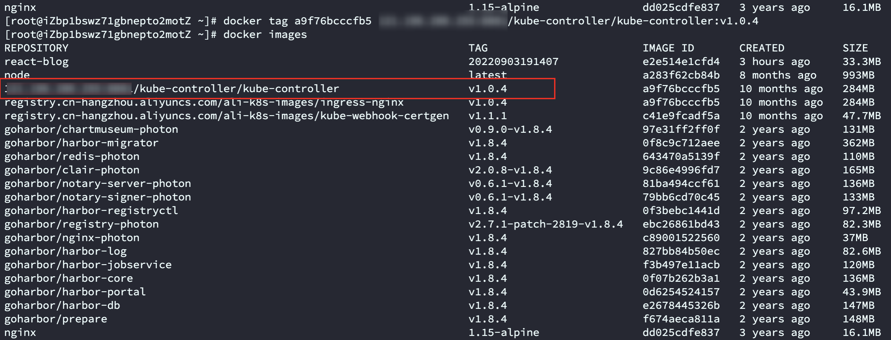

*   推送成功：

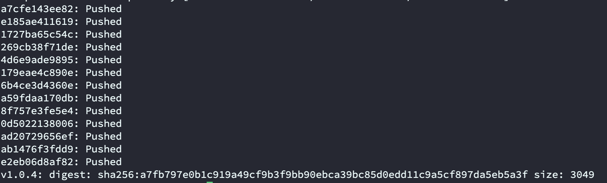

可以在页面中查看到，多了一个镜像。

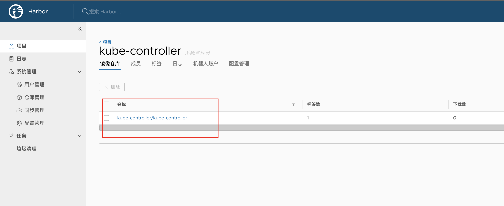

*   推送失败

出现下图这种情况时，可能是你在`创建仓库`时，将仓库设置成了`私有`。

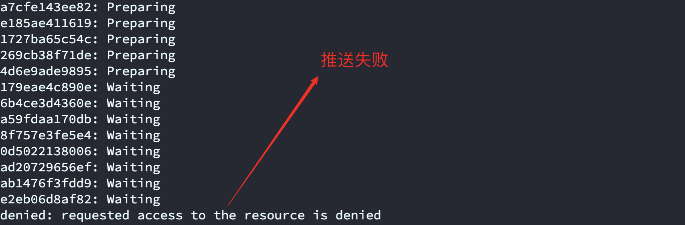

你可以在这里查看：

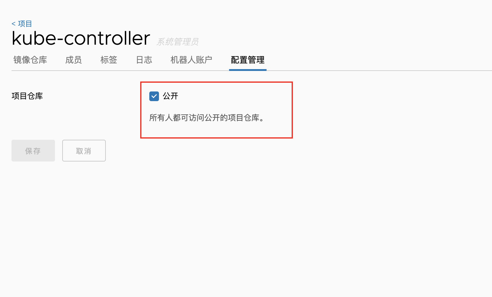

如果确认是公开的，那有可能你还`未登录`到镜像仓库，你需要查看`步骤3.3`先登录。

*   还有一个镜像推送也是同理，在这里大家可以自己动手试一试。

```bash
# 尝试推送它到你自己的镜像仓库吧
docker pull registry.cn-hangzhou.aliyuncs.com/ali-k8s-images/kube-webhook-certgen:v1.1.1
```

> Tips: 运行完上边命令后，可直接从`步骤4.4`开始哦\~

## 二、推送镜像到制品库

在完成镜像库配置后，我们就可以使用 `Jenkins` 推送自己的镜像到镜像库了。我们找到 `Jenkins` 任务中设置 `Shell `的编辑框。

如图所示：

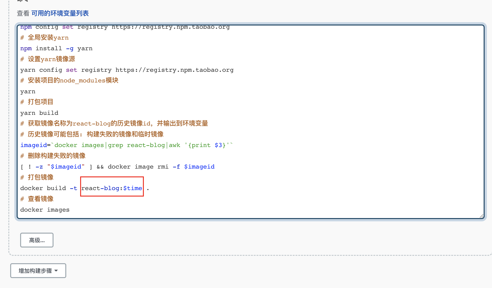

如果我们用红框中的`镜像名称`去提交到镜像仓库的时候，会失败。

> 原因：`docker` 在推送一个镜像时，**镜像的 Tag (名称:版本号) 开头必须带着镜像库的地址，才可以推送到指定的镜像库**。例如 `react-blog` 是不能推送到镜像库的。而 `121.196.200.255:8081/react-blog` 则可以推送到镜像库。
> 解决办法：可使用`docker tag`命令打标签，可查看`步骤4.4`

### 1、在原有命令的基础上，新增shell命令:

```bash
# 获取新镜像id
# react-blog是上一步打包好的镜像名称
imageid=`docker images|grep react-blog|awk '{print $3}'`
# 查看镜像
docker images
# 登录到镜像仓库
docker login -u $DOCKER_LOGIN_USERNAME -p $DOCKER_LOGIN_PASSWORD 这里填写你的服务器ip:8081
# 下边这两个命令可查看步骤4.4和4.5
# 给镜像打标签
# docker tag [打包好的镜像id] [服务器ip]:8081/[自己创建的个人镜像仓库的项目名称]/[打包好的镜像名称]:[使用时间作为版本号]
docker tag $imageid 这里填写你的服务器ip:8081/kube-controller/react-blog:$time
# 提交镜像到镜像仓库
# docker push [上一步打包好的镜像名称]
docker push 这里填写你的服务器ip/kube-controller/react-blog:$time
```

我们注意到这段命令中有四个特殊的字段:

\$imageid： 将打包好的`镜像id`存储到环境变量`imageid`中

\$time：将`当前时间`存储到环境变量`time`中

\$DOCKER\_LOGIN\_USERNAME：镜像仓库的用户名，从系统变量中的`DOCKER_LOGIN_USERNAME`获取

\$DOCKER\_LOGIN\_PASSWORD：镜像仓库的密码，从系统变量中的`DOCKER_LOGIN_PASSWORD`获取

> 其中，`$DOCKER_LOGIN_USERNAME`和`$DOCKER_LOGIN_PASSWORD`需要我们进行配置，当然我们也可以直接写死`用户名`和`密码`,但是并不推荐。

### 2、利用凭据给 Shell 注入镜像库用户名密码

这里我们可以借助 `Jenkins` 的凭据功能，添加一条用户名密码凭据，然后利用 `Shell 变量`写入在终端内。

找到任务的设置界面 => 构建环境 => 勾选 Use secret text(s) or file(s) => 找到左下角的新增按钮，选择 `Username and password (separated)`

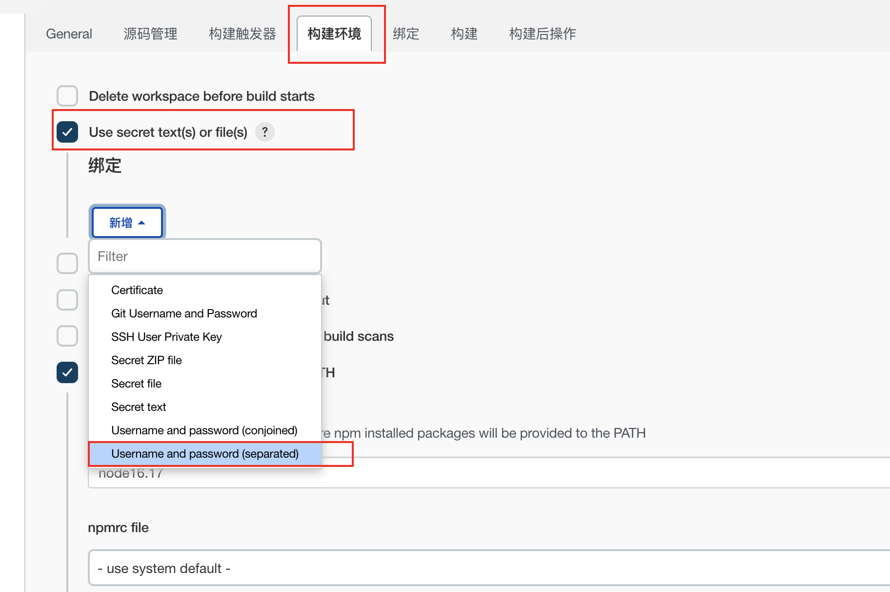

*   输入`用户名变量`和`密码变量`

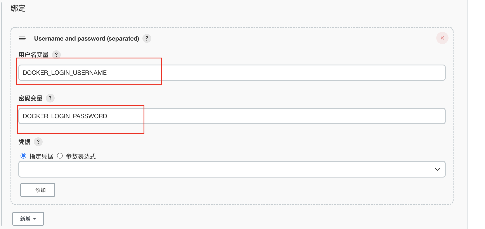

*   点击`添加`，添加`凭据`

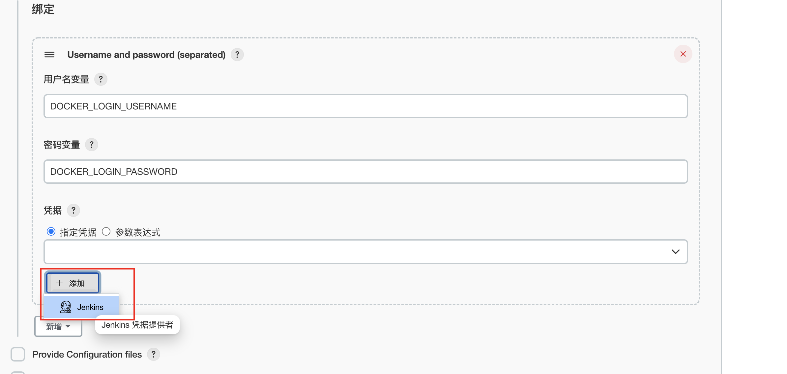

*   输入自己镜像仓库的`用户名`和`密码`即可：

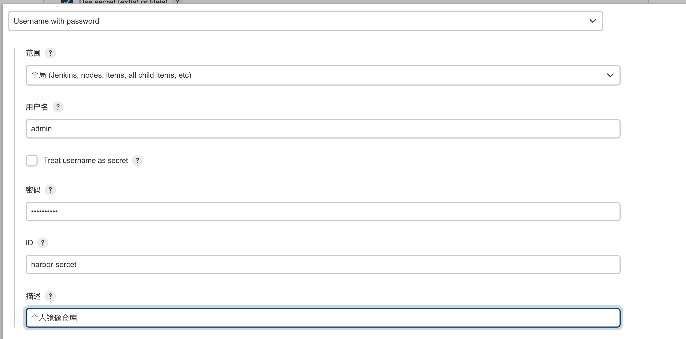

`ID`的值这里自定义就好, 然后点击`添加`, 最后点击`保存`。

*   点击`立即构建`，查看控制台输出

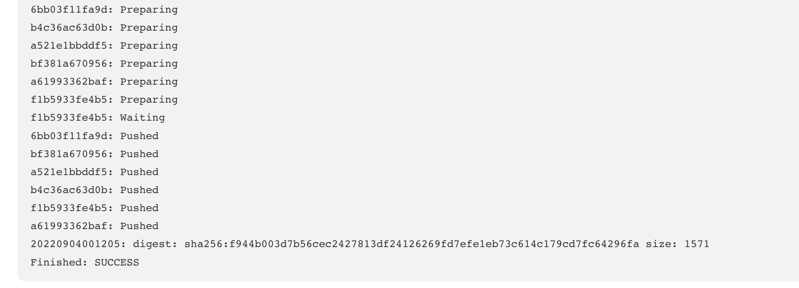

成功，非常完美\~\~\~
