# 04-Gitee、Jenkins、Harbor实现自动构建

上一节中我们学会了搭建自己的个人镜像仓库，同时又将打包好的镜像上传到镜像仓库，但似乎并没有体验到什么是`自动构建`，这一节，我们将把它们串联一起来。

## 一、回顾架构图

下图是我拆出来的一部分图

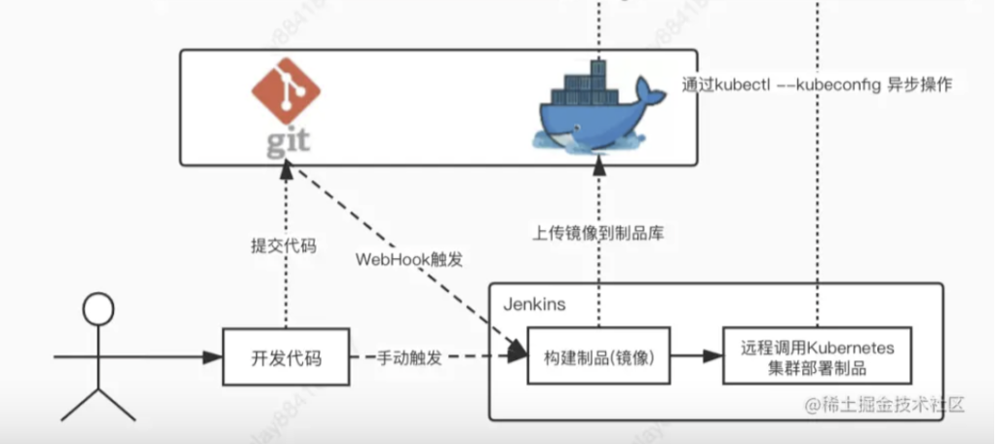

*   我们想要实现的自动构建流程：

开发人员`提交代码`到`Git仓库`后，`Git仓库`接收到`push`的指令，随后触发`webhook`，向`jenkins`发送请求，通知`jenkins`有新代码了，赶快拉取代码打包新的镜像然后上传到`harbor镜像仓库`吧！

*   我们已经实现的：

将代码提交到`Git`仓库，然后进入`jenkins`平台，点击`立即构建`，然后打包镜像并上传到`harbor镜像仓库`。

我们可以发现，到现在为止我们还需要手动去`jenkins`平台点击`立即构建`，这一节，我们要做的是提交代码到`Git仓库`后，让`Git仓库`去自动的通知`jenkins`。

## 二、配置webhook

### 1、下载安装插件

*   点击`系统管理` → `插件管理`

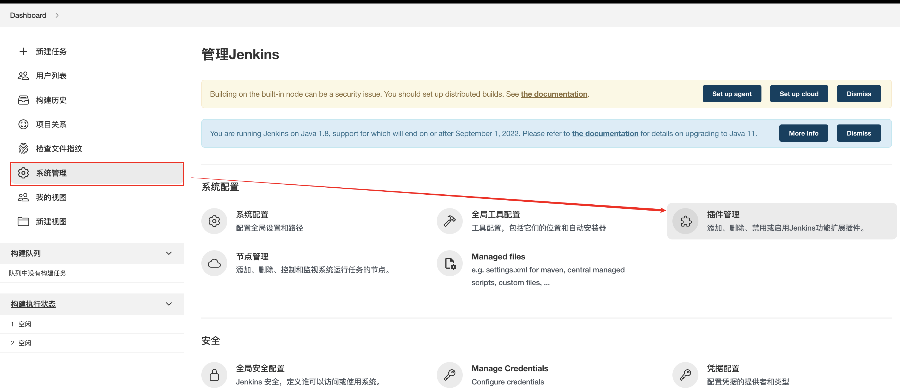

*   点击`可选插件` → `搜索webhook` → 勾选 `Generic Webhook Trigger` → 点击`install widthout restart`

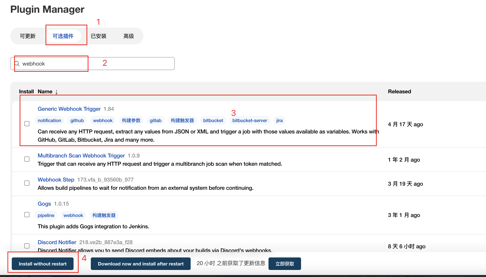

*   安装成功后，我们进入项目的`配置`，找到`构建触发器`，这里就会多出一个选项`Generic Webhook Trigger`，让我们勾选它。

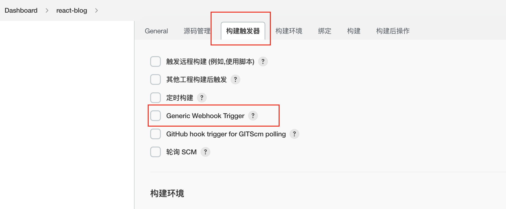

### 2、配置插件

#### 2.1 进入构建触发器

*   勾选完成后，如下图所示：

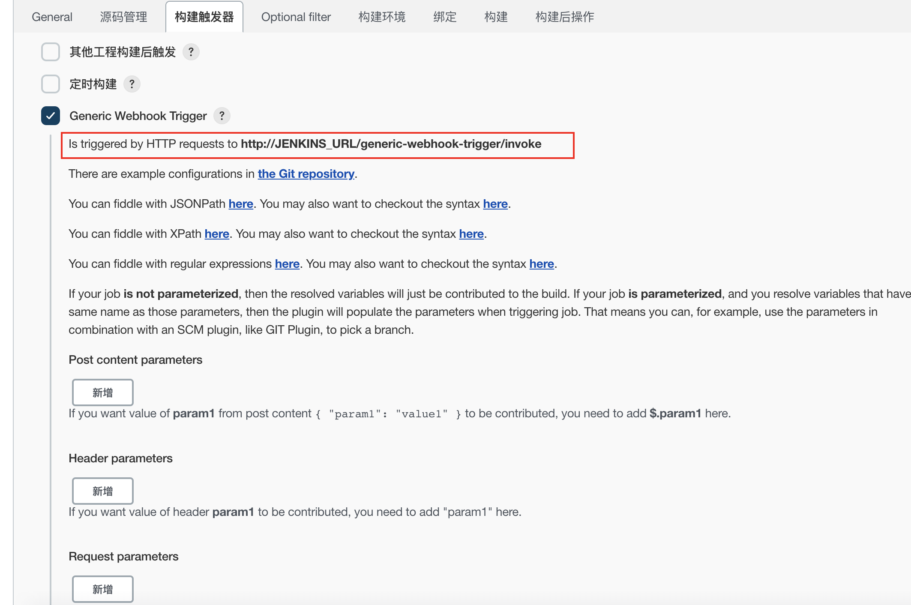

好了，我们`点击保存`按钮，红框中的地址就是我们需要在`Git仓库`中要配置的地址。

```bash
# JENKINS_URL： 这里需要替换你的jenkins地址，格式: [服务器ip]:[jenkins在服务器启动的端口]
http://JENKINS_URL/generic-webhook-trigger/invoke
```

将`JENKINS_URL`替换成你自己的地址后，让我们来调用一下它，你可以使用`Postman`或者`命令行`，亦或者在`浏览器`地址直接输入，这里我直接就用命令行演示一下。

```bash
curl http://[ip]:[端口]/generic-webhook-trigger/invoke
```

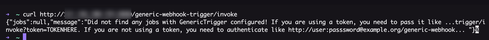

看到这输出，八成都是报错了，我们来看看它提示了啥：没有找到GenericTrigger的配置，它还告诉了我们应该怎么访问：

*   如果你想使用`token`访问，你的访问格式是：

```bash
http://[ip]:[端口]/generic-webhook-trigger/invoke?token=你配置的token
```

*   如果你不想使用`token`，你可以这样访问：

```bash
http://[jenkins用户名]:[jenkins登录密码]@[ip]:[端口]/generic-webhook-trigger/invoke
```

我们可以看到，第二种方法是不安全的，这样会把`jenkins`的用户名和密码暴露，因此我们采用第一种方法，当然两种方法都会介绍。

#### 2.2 在Gitee配置地址

**2.2.1 第一种方法：**

*   点击`系统管理` → `管理用户`

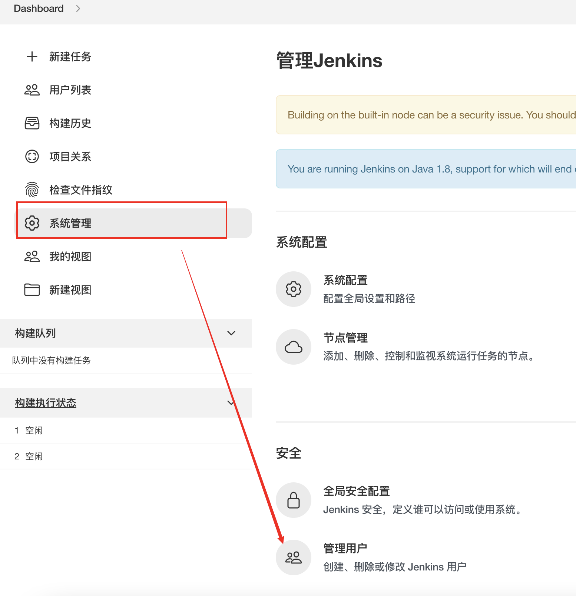

*   点击`小齿轮`

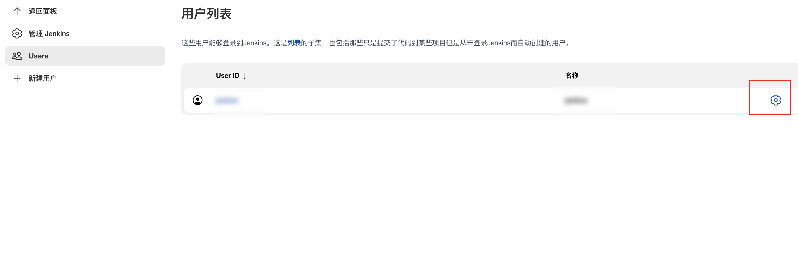

*   点击`添加新Token`  → `生成`

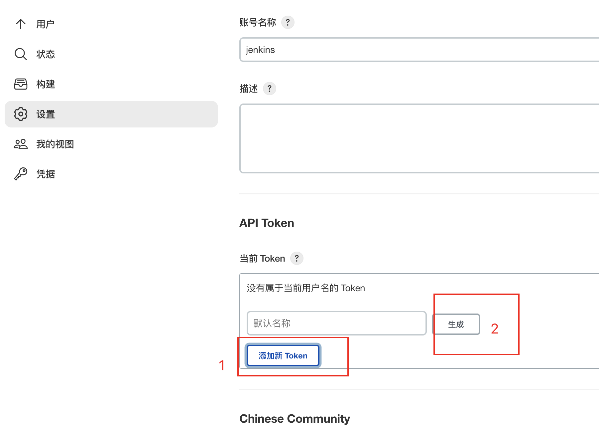

*   复制好`token`，然后`保存`。

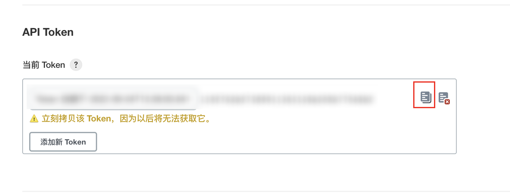

*   配置`Token`，在我们刚刚配置的`构建触发器`下边找到`Token`输入框，粘贴进去，然后保存。

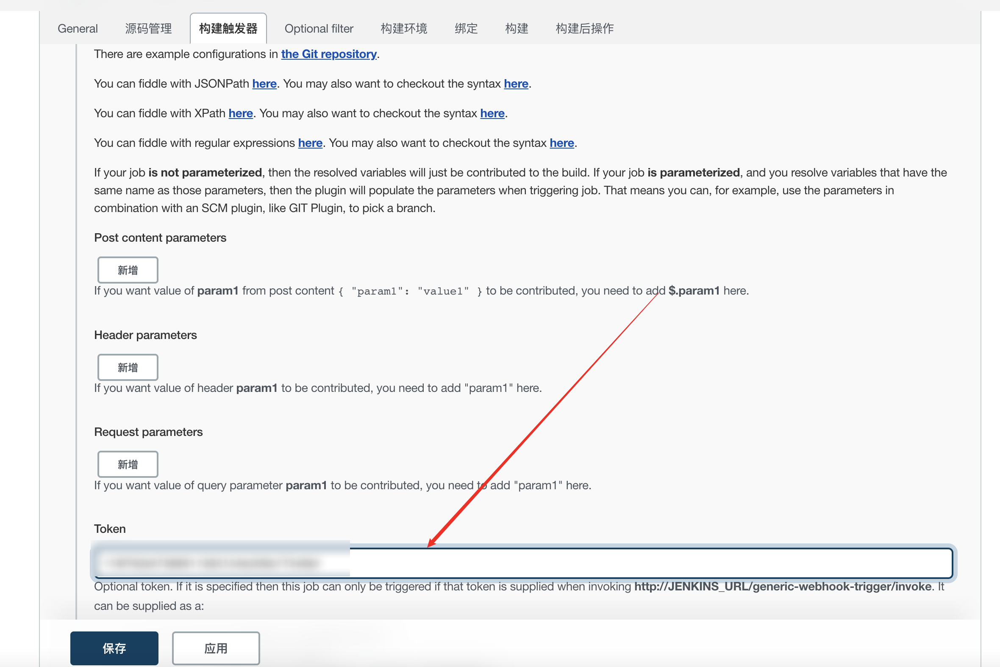

*   回到`Gitee`仓库的管理界面，点击`添加webHook`按钮，在`URL输入框`中输入你自己的地址。

```bash
# URL
http://[ip]:[端口]/generic-webhook-trigger/invoke?token=生成的token

```

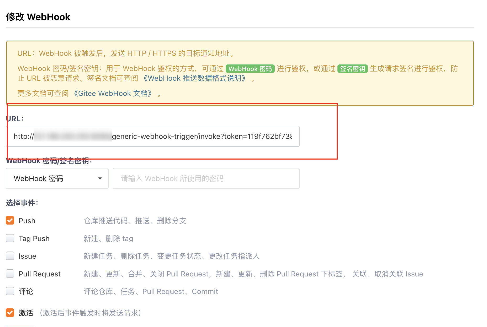

*   保存后，点击`测试`

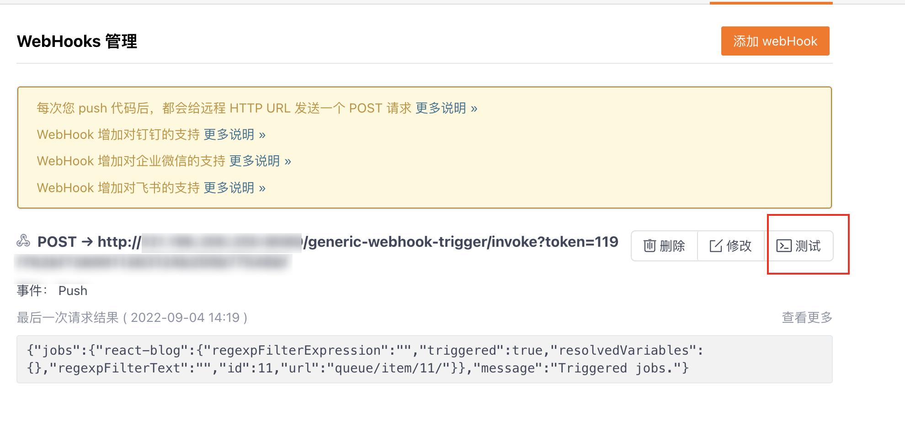

*   我们可以看到已经开始构建了

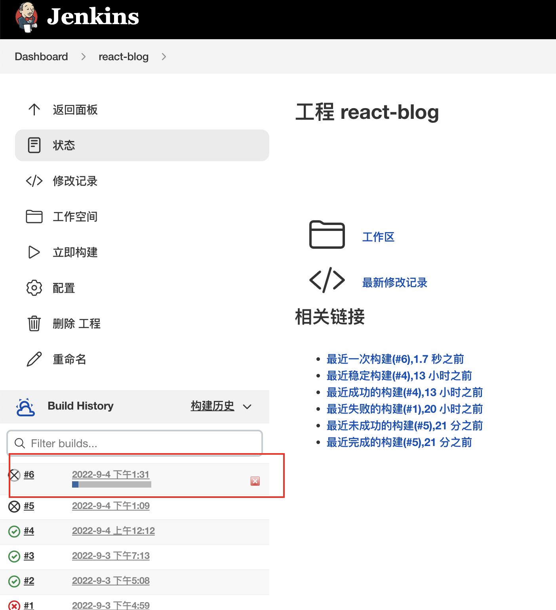

*   最后你可以尝试在你的项目中执行以下命令：

```bash
# 提交代码到本地工作区
git add .
# 提交信息
git commit -m "chore: add webhook"
# 提交代码到git仓库
git push
```

*   构建完成后，你还可以去harbor镜像仓库查看

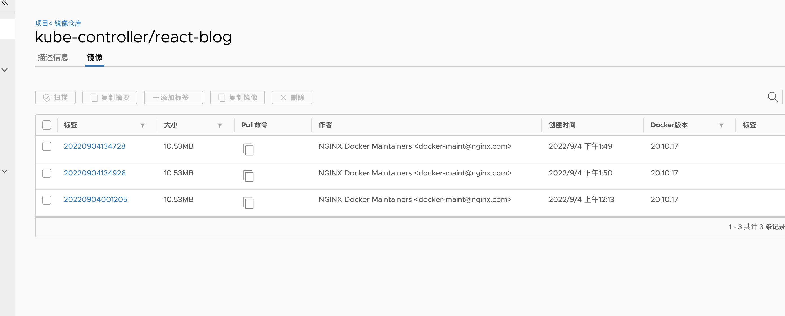

**2.2.2 第二种方法:**

*   回到`Gitee`仓库的管理界面，输入`URL`，保存即可。

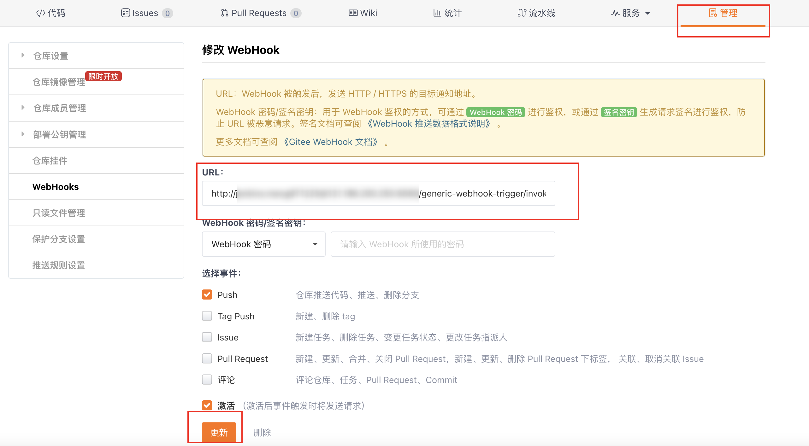

*   保存后，点击`测试`

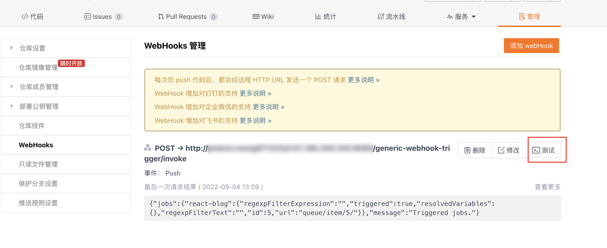

*   然后回到`jenkins`页面，我们可以看到，`jenkins`已经自己开始构建了。


## 三、结束语

到这里，我们已经完成了`CI`构建镜像的流程，后续我们将进行`CD`(持续部署)的学习。
