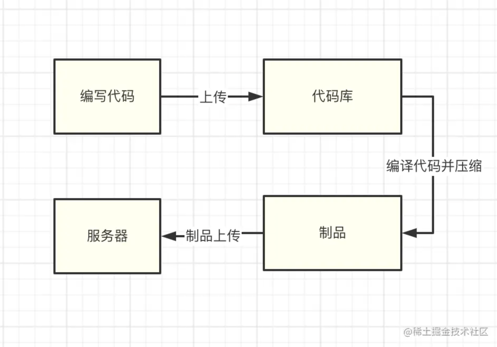
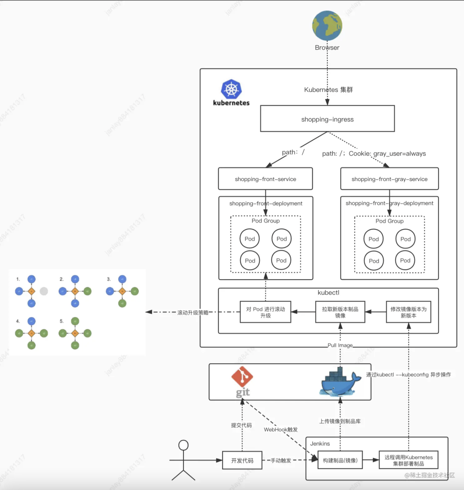

# 前言

## 什么是 CI/CD

***

在开发阶段，许多编译工具会将我们的源码编译可使用的文件。例如 `vue-cli` 的项目会被 `webpack` 打包编译为浏览器的文件，`Java` 项目会被编译为 `.class/jar` 文件以供服务器使用。

但是，开发人员过多关注构建和部署过程是很浪费时间的。以之前古老的的构建部署流程为例子，需要经历以下步骤：

1.  开发人员将源代码，经过编译、压缩等一系列流程打包为**制品**（意思为打包后的成品）

2.  将制品上传到服务器。

3.  在服务器将编译后的文件，手动部署在容器服务内（例如 `Nginx，Tomcat，Apache` 等服务）

显而易见，这种流程不仅繁琐，且容易出错，是非常影响开发效率的。开发人员要花一些时间浪费在这上面。那么有没有高效率，简单便捷一些的方式呢？

这就要提到 `CI/CD` 了。`CI` 的意思是 `持续构建` 。负责拉取代码库中的代码后，执行用户预置定义好的操作脚本，通过一系列编译操作构建出一个 `制品` ，并将制品推送至到制品库里面。常用工具有 Gitlab CI，Github CI，Jenkins 等。这个环节不参与部署，只负责构建代码，然后保存构建物。构建物被称为 制品，保存制品的地方被称为 “制品库”。

CD 则有2层含义： `持续部署（Continuous Deployment）` 和 `持续交付（Continuous Delivery）` 。 `持续交付` 的概念是：将制品库的制品拿出后，部署在测试环境 / 交付给客户提前测试。 `持续部署` 则是将制品部署在生产环境。可以进行持续部署的工具也有很多： `Ansible` 批量部署， `Docker` 直接推拉镜像等等。当然也包括我们后面要写到的 `Kubernetes` 集群部署。

## 自动化部署整体架构图

部署步骤换成文字叙述就是这样的：

1.  你写完了代码，提交到了 `Git` 代码库

2.  随后，代码库配置的 `WebHook` 钩子或人工手动启动了 `Jenkins` 的构建流程

3.  `Jenkins` 启动构建流程。按照你之前配置好的构建脚本，将代码编译成功。

4.  编译成功后，将编译后的文件打包为 `docker` 镜像，并将镜像上传到私有镜像库。

5.  随后，使用 `kubectl` 指定远程的k8s集群，发送镜像版本更新指令

6.  远程的k8s集群接收到指令后，去镜像库拉取新镜像

7.  镜像拉取成功，按照升级策略（滚动升级）进行升级，此时不会停机。

8.  升级完毕。

## 服务器搭配

为保证与生产环境的真实性，使用了ECS(云服务器)。

| 配置  | 技术栈                    | 系统版本  | 标签              |
| ----- | ------------------------- | --------- | ----------------- |
| 2核4G | Jenkins + Docker + Harbor | centos7.8 | 构建机            |
| 2核4G | Docker + Kubernetes       | centos7.8 | Kubernetes Master |
| 1核2G | Docker + Kubernetes       | centos7.8 | Kubernetes Node   |
